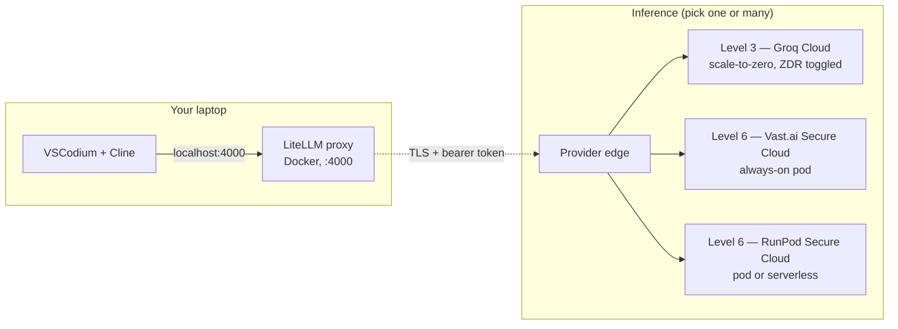

# zdr-coder

[](LICENSE)
[](COMPLIANCE.md)
[](COMPLIANCE.md)

**Self-host your AI coding assistant.** Like ChatGPT or Claude — but the AI runs on a server you control, your prompts never get used to train anyone's model, and it costs cents per session instead of $20/month.

> **New to this?** Jump to [**📚 If you've never used a terminal**](#-if-youve-never-used-a-terminal-read-this-first) for a step-by-step walkthrough. Most readers below are developers — that section is for everyone else.

## 📚 If you've never used a terminal, read this first

Most "self-host your AI" guides assume you're a developer. This section is for everyone else. **No coding experience required.** You'll spend ~30 minutes setting it up once, then never think about it again.

### What you'll get

- A chat window in your browser where you talk to an AI coding assistant (like ChatGPT, but private)
- Your code and conversations **never leave your computer or the AI provider** — no training data harvest, no logs
- **Pennies per session** instead of $20/month — Groq charges per-use, with $0 idle
- Works on **Mac, Windows, or Linux**

### What you'll need

| What | Where | Cost |
|---|---|---|
| **Docker Desktop** (the engine that runs everything) | https://docs.docker.com/desktop/ — pick your OS | Free |
| **A Groq account** (provides the AI) | https://console.groq.com/ | Free signup, pennies per use |
| **About 30 minutes** | — | Yours |

You will not need to:
- Know what an API, container, or proxy is
- Write or edit any code
- Run commands manually (after the one-time setup)

### Step-by-step setup

#### 1. Install Docker Desktop (10 min)

Go to the link in the table above, download the installer for your OS, run it.
After installing, open Docker Desktop and wait until the menu-bar/tray icon shows "Docker Desktop is running."
(You only do this once.)

#### 2. Get your free Groq API key (3 min)

1. Go to https://console.groq.com/ — sign up with Google or email.
2. Click **API Keys** in the left sidebar → **Create API Key** → copy the key (it starts with `gsk_...`). Save it somewhere safe — you'll need it in a moment.

#### 3. Turn on Zero Data Retention (1 min — important for privacy)

1. Go to https://console.groq.com/settings/data-controls
2. Toggle **Zero Data Retention** to **ON**.
3. This stops Groq from keeping any record of your prompts. You can verify it stuck by reloading the page.

#### 4. Download this project (2 min)

1. At the top of this page, click the green **`<> Code`** button → **Download ZIP**.
2. Unzip the file. You'll have a folder called `zdr-coder-main`. Move it somewhere you'll find it again (Documents, Desktop, anywhere).
3. Open the folder. Find the file called **`.env.example`** — make a copy and rename the copy to **`.env`** (yes, just `.env` — no `.example`).
4. Open `.env` in TextEdit (Mac) or Notepad (Windows). Find the line that says `GROQ_API_KEY=` and paste your Groq key from step 2 right after the `=`. Save and close.

#### 5. Start everything (one double-click)

- **Mac**: Double-click **`start.command`** in the project folder. *(If macOS warns about an "unidentified developer," right-click → Open → Open.)*
- **Windows**: Double-click **`start.bat`** in the project folder.

A Terminal/Command Prompt window will appear and show progress. After a minute or two it will say "Stack is running" and your browser will open to **http://localhost:3000** — that's the AI chat interface (OpenHands).

#### 6. Use it

1. In OpenHands, you'll see a chat box. Drop your project folder into the workspace pane (or just chat without a folder for general questions).
2. Type what you want the AI to do — "build me a simple todo app", "explain this code", "fix the bug where X happens", etc.
3. The AI will plan, edit files, and run commands inside its own sandbox. You watch and approve.

#### 7. Stop when done

Double-click **`stop.command`** (Mac) or **`stop.bat`** (Windows). This stops the AI and the proxy. Your API key and settings are preserved for next time.

To start again later: just double-click `start.command` again.

### What to do if something goes wrong

| Symptom | Fix |
|---|---|
| `start.command` says "Docker Desktop did not start" | Open Docker Desktop manually from Applications, wait for the icon to say "running," then try `start.command` again. |
| `start.command` says "Missing Groq API key" | It will open the `.env` file for you. Paste your key after `GROQ_API_KEY=` and save. |
| Browser shows "This site can't be reached" | Wait another 30 seconds — first launch is slow. Refresh the page. If still broken, double-click `stop.command` then `start.command` again. |
| Bills look higher than expected | You may have left a self-hosted GPU pod running. Double-click `stop.command` to stop everything. Groq API mode by itself costs $0 when idle. |
| Anything else | Take a screenshot and ask the friend who pointed you here. |

### Costs in plain language

Using the default setup (Groq API mode), your costs are roughly:

| What you're doing | Approximate cost |
|---|---|
| Stack sitting idle (you're not chatting) | **$0** |
| 1 hour of active AI coding work | **~$0.20** |
| 8 hours/day, every weekday, for a month | **~$30/month** |
| Compare: ChatGPT Plus | $20/month |
| Compare: Claude Pro | $20/month |

So at most workloads, this is **cheaper than ChatGPT Plus or Claude Pro** while giving you actual zero-data-retention.

---

## Why this exists

**Who it's for:** engineers who want AI coding assistance without handing their prompts to OpenAI / Anthropic / Google — including teams under HIPAA, SOC 2, or IP-sensitive workloads where "the model provider promises to be nice" isn't sufficient.

**What it gives you:** one local proxy on `http://localhost:4000`, two privacy-preserving inference paths behind it, and a [tier ladder](#pick-your-privacy-level) below mapping how this stacks up against every other AI option. Drop-in for VSCodium + Cline; switch between paths by changing the Cline **Model ID**.

**Why now:** ChatGPT Plus, Claude Pro, and Gemini Advanced all train on your input by default (or by tiny opt-in toggle), and none of the three are HIPAA-BAA-eligible. Your $20/mo buys faster models, not contractual privacy. This repo gives you **contractual ZDR** (Groq Cloud, with a self-serve toggle) or **physical ZDR** (your own pod on a Tier 3-4 datacenter) for less than $1/hr active and $0 idle. Total time to first request: 5 minutes for API mode, 15 minutes for a fresh pod.

**Honest about what it doesn't do:** no cryptographic E2E (provider still sees plaintext during inference — that's a Level 5 problem requiring TEE attestation), no FedRAMP / HITRUST of the rental platform itself (their datacenter partners have it transitively). [COMPLIANCE.md](COMPLIANCE.md) documents every gap with verbatim citations.

## Pick your privacy level

There are six levels of "how private is my AI." This repo gives you ⭐ levels 3 and 6 — the rest are listed so you can see where you'd otherwise land. Every claim below is sourced from the provider's own legal docs (links + verbatim quotes in [COMPLIANCE.md](COMPLIANCE.md)).

| Level | What it is | Cost | Provider sees your prompts? | Trained on by default? | HIPAA BAA? | Compliance certs | Good for |
|---|---|---|---|---|---|---|---|
| **1. Lowest** | Free consumer chat — chatgpt.com, claude.ai free, gemini.google.com | $0 | Yes, plaintext, sampled humans may read | ChatGPT & Gemini: **yes**. Claude: opt-in only. | ❌ never | ❌ free tier excluded | Throwaway questions |
| **2. Moderate** | $20/mo consumer subs — ChatGPT Plus, Claude Pro, Gemini Advanced | ~$20/mo | Yes, plaintext, sampled humans may read | ChatGPT Plus & Gemini Advanced: **yes**. Claude Pro: opt-in (toggle in settings). | ❌ Plus / Pro / Advanced **explicitly ineligible** | ❌ consumer tier excluded | Personal coding, nothing sensitive |
| **3. High** ⭐ *this repo: `*-api` routes* | Developer APIs with ZDR option — **Groq**, OpenAI API, Anthropic API, DeepInfra | $0.13–$4.50/hr active, **$0 idle** | Yes, plaintext, no human review under contract | ❌ contractually no | ✅ on request | SOC 2 Type 2, ISO 27001 (Groq) | Most use. Sensible default. |
| **4. Very high** | Enterprise cloud LLM APIs — **AWS Bedrock** (Anthropic Claude via Bedrock), **Azure OpenAI Foundry**, **GCP Vertex AI** | $3–$15 / million tokens (consumption-only, **no contract minimum**) | Yes, plaintext, cloud-vendor enforced no-access | ❌ contractually no | ✅ standard (Bedrock + Azure + GCP all have BAA in their default agreements) | SOC 2 Type 2, ISO 27001/27017/27018, **FedRAMP Moderate** (commercial) / **High** (GovCloud / Assured Workloads), **HITRUST CSF** | Regulated industries with audit obligations — HIPAA + FedRAMP/HITRUST required |
| **5. Maximum** | TEE-attested confidential inference — Tinfoil, GCP H100 CC mode | $5–$50/hr active or per-token | ❌ **cryptographically blind** — hardware-attested | ❌ enforced by hardware | ✅ via Tinfoil | Tinfoil: SOC 2 only. GCP: full stack | National security, ultra-paranoid PHI |
| **6. Own everything** ⭐ *this repo: `*-vast`, `*-serverless` routes* | Self-host open-weights on rented GPU. **Three sub-tiers by compliance ceiling**: (a) **Vast Secure Cloud** / **RunPod Secure Cloud** — cheapest BAA-eligible; (b) **AWS EC2 p5e/p5en** (8× H200) — FedRAMP/HITRUST inheritance, much pricier; (c) Azure/GCP equivalents — similar to AWS | (a) **$0.40–$15/hr** Vast/RunPod pods, $0 idle serverless; (b) **$39.80–$52.02/hr** AWS p5e/p5en | Only the datacenter host operator's root user; contractually prohibited from introspecting (RunPod explicit, Vast implicit; AWS strongest) | ❌ you control the model weights | ✅ via datacenter operator BAA (all three) | (a) SOC 2 Type 2 platform, ISO 27001 via DC partners; (b) **full AWS stack — SOC 2, ISO 27001, FedRAMP, HITRUST inherited** | Long sessions, full audit trail, no managed-model provider in the path. AWS sub-tier when FedRAMP/HITRUST required. |

A few non-obvious things from the research:

- **Paid consumer ≠ private.** ChatGPT Plus and Gemini Advanced **default to using your chats for training**. Claude Pro defaults to opt-in (same as free Claude). None of Plus / Pro / Advanced is HIPAA-BAA-eligible. The $20 buys you faster models and higher rate limits, not contractual privacy.
- **Free Claude is more private than free ChatGPT.** Claude requires opt-in for training; ChatGPT and Gemini opt you in by default. None are BAA-eligible.
- **AWS Nitro Enclaves can't run sonnet-class models.** Nitro Enclaves have no GPU. The "confidential AI on AWS" marketing requires GovCloud Provisioned Throughput, not Enclaves.
- **Vast/RunPod compliance** is split: the rental platform holds SOC 2 Type 2, but ISO 27001 belongs to their datacenter partners, not the platform itself.
- **Groq's ZDR is the strongest "Level 3" story** because the toggle is self-serve in every account — most competitors gate ZDR behind enterprise contracts.

For each cell with verbatim provider quotes + URLs: see [COMPLIANCE.md](COMPLIANCE.md).

## What you get from this repo

| If you want… | Run this | Cost shape |
|---|---|---|
| Level 3 (API + ZDR), fastest setup | `./scripts/api-up.sh` | $0.13–$0.56/hr active, $0 idle |
| Level 6 always-on pod, cheapest | `./scripts/deploy-vast.sh haiku` (or sonnet / opus) | $0.40–$15/hr while up |
| Level 6 scale-to-zero, private | `./scripts/deploy-serverless.sh haiku` (or sonnet) | $0 idle, ~$0.50–$6/hr active |
| Stop everything | `./scripts/destroy.sh all` | $0 |

All three use the **same local endpoint** (`http://localhost:4000`). Switch between them in Cline by changing the **Model ID** field — no restart.

## Five-minute setup

```bash
# 1. Install prereqs once (Docker, jq, openssl, VSCodium, Cline extension)
./scripts/install-prereqs.sh                     # macOS / Ubuntu / Debian
# or .\scripts\install-prereqs.ps1               # Windows (PowerShell as admin)

# 2. Set up your API keys
cp .env.example .env
$EDITOR .env                                     # set GROQ_API_KEY and/or VAST_API_KEY

# 3. Pick a path and run it
./scripts/api-up.sh                              # Level 3 — easiest, ZDR via Groq
# OR
./scripts/deploy-vast.sh haiku                   # Level 6 — your own GPU pod
```

### Pick a client

LiteLLM is now serving an OpenAI-compatible endpoint on `http://localhost:4000/v1`. Point any agentic coding tool at it:

**OpenHands (browser-based — best for non-developers, or anyone who wants a visual workspace):**

```bash
./scripts/openhands-up.sh           # starts at http://localhost:3000
./scripts/openhands-down.sh         # stop
```

Browser UI with file workspace, sandboxed shell, plan/act loops. Backed by the same LiteLLM proxy. The non-developer `start.command` / `start.bat` launchers wrap this path end-to-end (Docker → LiteLLM → OpenHands → browser).

**Aider (terminal, recommended for developers — no extension fragility):**

```bash
./scripts/aider-up.sh   # one-time install (pipx install aider-chat)
./scripts/aider.sh      # launch — defaults to sonnet-api
```

Slash commands inside Aider: `/add <file>`, `/run <cmd>`, `/commit`, `/undo`, `/help`. Works flawlessly over SSH/tmux. To switch tier mid-session: exit and `ZDR_MODEL=haiku-api ./scripts/aider.sh`.

**Cline / Roo Code (VSCode/VSCodium extension):**

VSCodium → Cline (or Roo) → gear icon:

- **API Provider**: OpenAI Compatible
- **Base URL**: `http://localhost:4000/v1`
- **API Key**: contents of `.litellm-key` (auto-generated; `cat .litellm-key`)
- **Model ID**: `sonnet-api` (or `sonnet-vast` / `haiku` / etc — see below)

Cline is more autonomous; Aider is more controllable. Pick whichever fits your workflow. For SSH-Remote dev specifically, Aider avoids a class of extension-host networking bugs — see [Using Cline from a remote SSH host](#using-cline-from-a-remote-ssh-host-vscodium-remote-ssh-tailscale-ssh-etc) below.

Done. Start coding.

## Available model IDs

| Model ID | What runs | Where | Tier mapping | Notes |
|---|---|---|---|---|
| `haiku-api` | **GPT-OSS 20B** (OpenAI open-weight, coding-tuned) | Groq Cloud | Level 3, ~Haiku-class | $0.10/hr active, $0 idle |
| `sonnet-api` | **GPT-OSS 120B** (OpenAI open-weight reasoning) | Groq Cloud | Level 3, ~Sonnet-ish | $0.20/hr active, $0 idle |
| `haiku-vast` | Qwen2.5-Coder-32B-AWQ (18GB INT4) | Vast Secure Cloud pod | Level 6, ~Haiku-class | $0.40–0.67/hr while up |
| `sonnet-vast` | DeepSeek V4 Flash (158B FP8, 149GB weights) | Vast Secure Cloud pod | Level 6, **~Sonnet-class** | $5.87/hr while up |
| `opus-vast` | **Kimi K2.6** (1T params, 554GB weights) — **88.7% SWE-Bench, beats Opus 4.7** | Vast Secure Cloud pod | Level 6, **≥Opus 4.7 on SWE-Bench** | $7.74–$11.74/hr while up |
| `haiku-serverless` | Qwen2.5-Coder-32B-AWQ | RunPod Serverless | Level 6, scale-to-zero | $0 idle, ~$0.50/hr active |
| `sonnet-serverless` | DeepSeek V4 Flash | RunPod Serverless | Level 6, scale-to-zero | $0 idle, ~$6/hr active (H200, capacity-dependent) |
| `haiku` / `sonnet` / `opus` | Same as `-vast` | RunPod always-on pod | Level 6, alt provider | Usually more expensive than Vast |

Switching is instant — just change the field in Aider (`ZDR_MODEL=...`) or Cline (Model ID).

### Honest tier mapping — what actually matches each Claude tier?

The aliases (`haiku-api`, `sonnet-api`, `opus-vast`) are aspirational labels mapped to the best ZDR-eligible open-weights option for that compute shape. As of May 2026:

| Want | ZDR-eligible route in this repo | Real cost | Honest performance vs Claude |
|---|---|---|---|
| Haiku-class, cheapest | `haiku-api` (GPT-OSS 20B on Groq) | $0.10/hr active, $0 idle | Comparable to Haiku for simple edits; coding-tuned |
| Sonnet-ish, scale-to-zero | `sonnet-api` (GPT-OSS 120B on Groq) | $0.20/hr active, $0 idle | Between Sonnet 3.5 and Sonnet 4 for agentic loops; weaker on long-context multi-file work |
| Sonnet-class, self-hosted | `sonnet-vast` (DeepSeek V4 Flash on Vast 4× H100) | $5.87/hr while up | Solid Sonnet-class; FP8 weights, 65K context |
| **Opus-class (best open option)** | `opus-vast` (**Kimi K2.6** on Vast 8× H100 or 4× H200) | $7.74–$11.74/hr while up | **88.7% SWE-Bench vs Opus 4.7's 87.6% — Kimi K2.6 wins.** Trade Opus's edge on GPQA / long-context / tool orchestration for the strongest SWE-Bench open-weights score. |

There is **no Groq-API equivalent for Opus-tier** — Groq's production catalog tops out at GPT-OSS 120B, which sits between Sonnet and Opus on capability. Opus-class under ZDR means self-hosting (`opus-vast`) — but the news is that **the open-weights champion (Kimi K2.6) actually beats Opus 4.7 on SWE-Bench Verified**. Detailed benchmarks in the [Opus-tier section below](#opus-tier-on-open-weights--kimi-k26-is-the-answer-not-deepseek-v4-pro).

### Performance caveats — read this before betting on these aliases

**ZDR-first framing**: this repo prioritizes the contractual + technical privacy posture over hitting Claude's exact quality on every workload. The model choices are *the best ZDR-eligible options*, not necessarily the absolute best model. Specific caveats:

- **Long-horizon tool-use consistency**: Claude Opus 4.7 still leads on 20+ tool-call agentic loops. Open-weights models including Kimi K2.6 drift more in long sessions. Mitigation: shorter task scope per `aider` session, explicit `/clear` between unrelated tasks.
- **Aider edit-block format compliance**: Llama 3.3 70B and older Qwen models drop the diff format ~5–10% of the time on multi-file refactors. GPT-OSS 120B and Kimi K2.6 are noticeably more reliable. If a model misbehaves, try `--edit-format whole` or `--edit-format udiff`.
- **GPQA / scientific reasoning**: Opus 4.7 leads (~94.2%). No open-weights model matches it yet on this specifically.
- **MCP-Atlas / structured tool orchestration**: Opus 4.7 leads. Cline/Roo's tool-call layer may produce more retries on open-weights models — not a model defect per se, just edge cases.
- **Adversarial-prompt robustness**: Closed frontier models have stronger safety/jailbreak resistance. Not relevant for solo coding work, important if you're exposing the proxy to untrusted inputs.
- **Context length** in practice: Groq's GPT-OSS 120B is 131K context, K2.6 self-hosted is 256K, but quality degrades meaningfully past ~50K input on all open models. Keep contexts tight.
- **Cost vs quality crossover**: Below ~2 hrs/day of opus-tier use, Anthropic Opus API at $30/hr is cheaper than running `opus-vast` at $7.74/hr × 24. Self-hosted opus wins on **continuous use + ZDR mandate**, not just "I want a frontier model occasionally."

### Current Groq production catalog (May 2026)

| Groq model | Tok/s | $/M in | $/M out | Closest Claude | Wired in this repo |
|---|---|---|---|---|---|
| **GPT-OSS 20B** | 1000 | $0.075 | $0.30 | Haiku-class, coding-tuned | ⭐ current `haiku-api` |
| **GPT-OSS 120B** | 500 | $0.15 | $0.60 | Sonnet-ish, coding-tuned | ⭐ current `sonnet-api` |
| Llama 3.1 8B Instant | 560 | $0.05 | $0.08 | Haiku-ish | available — older default |
| Llama 3.3 70B Versatile | 280 | $0.59 | $0.79 | Sonnet 3.5-ish (weaker for code) | available — 3× pricier than GPT-OSS 120B |

DeepSeek V3/V4 and Kimi K2.6 are *not* in Groq's production catalog — DeepSeek is preview-only (excluded from BAA per §1.1), Kimi isn't hosted by Groq at all. For those under ZDR you need self-hosted (Level 6).

## Compliance posture

This repo's **Level 3** + **Level 6** paths together cover:

- ✅ Zero data retention (Groq self-serve toggle; Vast/RunPod by container ownership)
- ✅ No training on your data (contractual on Groq; physical on self-hosted)
- ✅ HIPAA BAA available (all three providers — see [COMPLIANCE.md](COMPLIANCE.md) for request process)
- ✅ SOC 2 Type 2 (Groq Inc, Vast Inc, RunPod Inc as of Oct 2025)
- ✅ Encryption in transit (TLS to provider edge)
- ✅ US data residency (default on all three)
- ✅ No third-party model provider in the inference path (Level 6)

What this repo does **not** give you out of the box:

- ❌ Cryptographic end-to-end (provider still sees plaintext during inference — Level 5 only)
- ❌ FedRAMP / HITRUST (Level 4 cloud APIs; or self-certify on Level 6 self-hosted)
- ❌ EU data residency (US-default; pick `*-vast` with `geolocation=EU` to override)
- ❌ Side-channel resistance on multi-tenant GPUs

[COMPLIANCE.md](COMPLIANCE.md) has the full mapping with verbatim quotes from each provider's binding legal docs, plus the 7-step checklist for maintaining max-ZDR posture on Groq.

---

## Architecture



- **LiteLLM** is the local OpenAI-compatible proxy. Routes per-model-ID aliases, holds the master API key, injects per-route bearer tokens. Bound to `127.0.0.1` only — never exposed.
- **Groq** path is direct API. ZDR toggle in console gates retention.
- **Vast / RunPod** paths spin up a pod running [`gpu-node/Dockerfile`](gpu-node/Dockerfile) (vLLM + your chosen model). LiteLLM connects via TLS-terminated proxy URL + bearer token.
- **Cline** = the agentic coding extension in VSCodium. Talks to LiteLLM on localhost.

No mesh VPN — provider-managed transport (TLS) + bearer tokens is the same E2E envelope, simpler to operate.

## Pod vs serverless vs API — when each wins

|  | API (Level 3, Groq) | Pod (Level 6, always-on) | Serverless (Level 6, scale-to-zero) |
|---|---|---|---|
| Idle cost | $0 | $0.40–$15/hr | $0 |
| Active cost | per-token (~$0.13–$0.56/hr equivalent) | included in hourly | per-second of worker uptime |
| First request | 100ms | instant (host warm) | ~3–5 min cold-start (sometimes longer for sonnet) |
| Capacity risk | Groq has plenty | thin on 80GB+ for sonnet/opus | thin on H200 for sonnet |
| Privacy | contractual ZDR | physical (your container) | physical (your container) |
| Best for | most use — bursty or continuous | 4+ hrs/day on one tier | bursty but private |

Rule of thumb: **<2 hrs/day → Level 3 API.** **>4 hrs/day → Level 6 pod.** **In between → Level 6 serverless.**

## Cost comparison — live snapshot, May 2026

Always-on pod pricing for each tier (from current available on-demand offers):

| Tier | RunPod Secure $/hr | Vast Secure Cloud $/hr | AWS EC2 $/hr | Notes |
|---|---|---|---|---|
| haiku (1× RTX 4090 24GB) | $0.69 | **$0.40–0.67** | n/a — AWS doesn't rent 4090s | Vast cheapest when Iceland host rentable |
| sonnet (4× A100 / 4× H100 80GB) | $5.96 (often sold out) | **$4.27** (A100) or **$5.87** (H100 SXM) | $32–40 (p4de / p5) | Vast supply thin, 1–2 hosts at a time; AWS p5 even thinner |
| opus (8× H100 SXM 80GB) | $23.92 (often sold out) | **$11.74** | $50–98 (p5.48xlarge) | France datacenter when listed |
| opus *(alt)* 4× H200 140GB | — | **$7.74** | — | 560 GiB > Kimi K2.6's 554 GiB weights |
| opus *(frontier — DeepSeek V4 Pro)* | — | — | **$39.80–$52.02** (p5e.48xlarge / p5en.48xlarge 8× H200) | See "DeepSeek V4 Pro" section below |

Versus going Anthropic-direct (no self-hosting): ~$30/hr for Opus-class agentic-coding workload. Crossover for opus is **~1.5 hrs/day** before self-hosted wins on cost.

### Opus-tier on open weights — Kimi K2.6 is the answer, not DeepSeek V4 Pro

**Important update (May 2026):** the strongest open-weights model for agentic coding is **Kimi K2.6** (Moonshot, April-May 2026), not DeepSeek V4 Pro. Verified benchmarks:

| Model | SWE-Bench Verified | Terminal-Bench 2.0 | Where wired in this repo |
|---|---|---|---|
| **Kimi K2.6** | **88.7%** | **82.7%** | ⭐ `opus-vast` (already running this) |
| Claude Opus 4.7 | 87.6% | — | n/a (closed API only) |
| DeepSeek V4 Pro | 80.6% | — | not wired |
| GPT-5.5 | — | — | not wired |

Kimi K2.6 **beats Opus 4.7 by 1.1 points on SWE-Bench Verified** and is the highest-scoring model in the May 2026 leaderboard on both SWE-Bench and Terminal-Bench 2.0. The repo's `opus-vast` route already uses it — so **the strongest open-source opus-class is already live in this repo**.

**Where Opus 4.7 still wins (real performance caveats):**

- **GPQA Diamond** (scientific reasoning): Opus 4.7 ~94.2% — leads
- **Long-context coherence on 100K+ token sessions**: Opus 4.7 still more consistent
- **MCP-Atlas / structured tool orchestration**: Opus 4.7 leads
- **Agentic coding consistency over very long horizons** (20+ tool calls): Opus 4.7 has the edge
- **Edge-case handling on adversarial prompts**: Opus 4.7's safety training is more robust

**Where Kimi K2.6 wins:**

- Pure SWE-Bench Verified score
- Terminal-Bench 2.0 (real-world terminal-based agentic tasks)
- Multilingual coding (non-English codebases)
- Agent-swarm coordination
- Competition math
- **Cost: 5–6× cheaper than Opus** when self-hosted at typical workloads

**Honest verdict for this repo's threat model:** If your blocker is ZDR, `opus-vast` (Kimi K2.6 on Vast 8× H100 or 4× H200) is the right call. You give up ~5–10% on long-horizon coherence and tool orchestration in exchange for **contractually + technically guaranteed ZDR**, no managed-provider in the path, and a model that's actually ahead on SWE-Bench. For most coding work the gap is invisible.

### Other recent OSS frontier releases (April–May 2026) worth knowing

| Model | Vendor | License | Notes for this repo |
|---|---|---|---|
| **Kimi K2.6** | Moonshot | open weights | Best opus-tier — already wired as `opus-vast` |
| **DeepSeek V4 Pro** | DeepSeek | open weights | 80.6% SWE-Bench — strong but below Kimi K2.6. AWS sub-tier candidate (see below). |
| **DeepSeek V4 Flash** | DeepSeek | open weights | Already wired as `sonnet-vast` — sonnet-class FP8 |
| **GLM-5.1** | Z.ai | open weights | Newer, similar tier to DeepSeek V4 Flash |
| **Qwen 3.6** | Alibaba | Apache 2.0 | Strong on broad benchmarks; not yet wired |
| **MiMo-V2.5-Pro** | Xiaomi | open weights | Strong reasoning |
| **MiniMax M2.7** | MiniMax | open weights | Recent open-source |
| **Gemma 4** | Google | open weights | Smaller — haiku-tier |
| **Ring-2.6-1T** | Ant Group (inclusionAI) | open weights | Large MoE, 1T params |

### DeepSeek V4 Pro on AWS (Level 6 + L4-tier compliance) — when this makes sense

**DeepSeek V4 Pro is one viable open-weights opus-class model** — 1.6T params MoE, ~49B active per token, 80.6% on SWE-bench (lower than Kimi K2.6's 88.7%, but ahead of most). Weights ~864 GB. Doesn't fit on 8× H100 80GB (640 GB total < 864 GB); minimum viable host is **8× H200 141GB = 1,128 GB single node**, or 16× H100 across 2 nodes with NVLink+InfiniBand.

AWS EC2 instances that fit it (verified May 2026):

| Instance | Spec | US East (Ohio) $/hr | US West (N. California) $/hr | Availability |
|---|---|---|---|---|
| **p5e.48xlarge** | 8× H200, Sapphire Rapids CPU, 1,128 GiB HBM3e | **$39.80** (was $34.61 pre-Jan 2026) | **$49.75** | **Tight** — AWS hiked 15% in Jan due to GPU demand |
| **p5en.48xlarge** | 8× H200 + Gen5 PCIe (faster CPU↔GPU) | ~$42 estimated Ohio | **$52.02** | Tighter than p5e |

**Honest realities for this path:**
- **~$40/hr in Ohio is the floor for DeepSeek V4 Pro on AWS** — and US East has the best supply.
- **Capacity is generally not on-demand** — you typically use **EC2 Capacity Blocks for ML** (pre-book 1–6 month windows in cluster sizes 1–64 instances). On-demand p5e/p5en availability is genuinely scarce in May 2026.
- **Compliance inheritance is the reason to pick AWS over Vast** — AWS Bedrock-tier BAA + SOC 1/2/3 + ISO 27001/27017/27018 + FedRAMP Moderate (commercial) / High (GovCloud) + HITRUST CSF all inherit transitively to the EC2 instance you run vLLM on. Vast/RunPod can't match that audit story.
- **Cost vs Anthropic Opus API:** Anthropic Opus 4.7 ≈ $30/hr typical agentic load. AWS DeepSeek V4 Pro ≈ $40/hr. The self-hosting math **does not work for opus-tier on AWS** at current prices — Vast at $7.74/hr (4× H200) is 5× cheaper if your compliance bar is BAA-only rather than FedRAMP/HITRUST.
- **Capacity Block reservations** lock you into 1–6 months at a fixed rate. If your usage is <40 hrs/month, on-demand Vast wins on flexibility even at higher hourly.

**When AWS Level 6 actually makes sense:**
1. You need **FedRAMP / HITRUST inheritance** on the inference path itself (Vast/RunPod can't give you this).
2. You have **predictable continuous workload** (>4 hrs/day, 5 days/week) to amortize a Capacity Block reservation.
3. Your data-governance team requires AWS-tier vendor risk management — not just BAA paper.

For most users, **`opus-vast` on Vast.ai 4× H200 at $7.74/hr remains the right call.** AWS H200 is the answer only when the compliance ceiling demands it.

DeepSeek V4 Pro vs Claude Opus 4.7: Opus is still better at long-context coherence and tool-use consistency. V4 Pro is closer on raw reasoning benchmarks. For agentic coding specifically, Opus still edges it — but the gap is small enough that self-hosting V4 Pro is a real choice if compliance forces it.

## Setup detail

### Pick your provider(s)

You only need to set up the providers you'll actually use.

**Vast.ai** — cheapest Level 6 path
1. Sign up at https://cloud.vast.ai/
2. Account → Create API Key → Advanced tab
3. Permissions: **Instances** = Read+Write, everything else minimal, **2FA off** (programmatic key)
4. Copy → `.env` as `VAST_API_KEY=...`

**RunPod** — only provider with serverless wired today
1. https://console.runpod.io/user/settings → API Keys → Create
2. Permissions: **All** scope (Restricted returns 403 on serverless `/openai/v1`)
3. Add credit, copy → `.env` as `RUNPOD_API_KEY=...`

**Groq Cloud** — Level 3
1. Sign up at https://console.groq.com/
2. **Enable ZDR before first request**: https://console.groq.com/settings/data-controls
3. Create API key → `.env` as `GROQ_API_KEY=...`
4. (HIPAA) email security@groq.com requesting a counter-signed BAA — see [COMPLIANCE.md](COMPLIANCE.md)

### Deploy and tear down

```bash
# Level 3 — API mode
./scripts/api-up.sh                              # bring up LiteLLM with -api routes
./scripts/destroy.sh api                         # stop LiteLLM, keep keys

# Level 6 — Vast pods (recommended)
./scripts/deploy-vast.sh haiku                   # 1× RTX 4090, ~$0.40–0.67/hr
./scripts/deploy-vast.sh sonnet                  # 4× H100 80GB, ~$5.87/hr
./scripts/deploy-vast.sh opus                    # 8× H100 80GB, ~$11.74/hr

# Level 6 — RunPod alternatives
./scripts/deploy.sh haiku                        # always-on pod
./scripts/deploy-serverless.sh haiku             # scale-to-zero
./scripts/deploy-serverless.sh sonnet            # scale-to-zero (H200, capacity-dependent)

# Teardown
./scripts/destroy.sh haiku-vast                  # one tier
./scripts/destroy.sh all                         # everything across all providers
```

Pod termination stops billing within ~1 min. Serverless idle is already $0 (`workersMin=0`); teardown removes the endpoint + template.

### Running multiple tiers in parallel

Parallel cold-start, ~15-20 min wall time vs serial:

```bash
./scripts/deploy-vast.sh haiku &  ./scripts/deploy.sh sonnet &  wait
```

Each deploy is independent — separate bearer token, separate model alias in LiteLLM. All share `http://localhost:4000`. Switch in Cline by changing the **Model ID**.

### Using Cline from a remote SSH host (VSCodium Remote-SSH, Tailscale SSH, etc.)

If your VSCodium runs on a Mac but you're connected via Remote-SSH to a Linux box, Cline runs in the remote extension host — so its `localhost:4000` means the remote machine, not your Mac. LiteLLM stays on the Mac (keeps your provider API keys local); we tunnel port 4000 back over the SSH session you're already opening:

```bash
./scripts/tunnel.sh init <ssh-host>     # adds RemoteForward 4000 to ~/.ssh/config
./scripts/tunnel.sh deinit <ssh-host>   # removes it
./scripts/tunnel.sh status              # shows configured hosts
```

After `init`, reconnect any open Remote-SSH window (close → reopen). Cline's Base URL stays `http://localhost:4000/v1` — it's now forwarded back to your Mac. No tailnet ACL changes, no extra listeners exposed on your Mac, encrypted by the same SSH transport you're already using.

If your tailnet ACL *does* allow remote → Mac (uncommon for tagged-devices → user setups), there's also an opt-in `docker-compose.tailscale.yml` that adds a Tailscale-interface binding — see comments in that file.

### Persistent model cache (opus economics)

Avoid re-downloading the 554 GiB Kimi K2.6 weights every day:

```bash
./scripts/vol-up.sh opus            # one-time ~$6 + ~1-2 hr download
./scripts/deploy-vast.sh opus       # subsequent: 3-5 min cold start
./scripts/destroy.sh opus-vast      # stops compute, keeps volume
./scripts/vol-down.sh opus          # delete volume (end of project)
```

Monthly cost: ~$986 for 80 hrs/mo of opus use (4 hrs/day × 20 days) — about **60% cheaper than Anthropic Opus API** at typical agentic-coding token mix.

**Caveat**: Vast volumes are pinned to a specific host. If that machine disappears, the volume is unavailable until it comes back. RunPod network volumes (host-independent) aren't wired in this repo yet.

## Things we learned the hard way

Field-tested gotchas baked into the scripts as comments and filters:

- **Vast `verified` ≠ datacenter.** `verified: {eq: true}` means "host passes basic reliability checks" (marketplace tier, Docker-only isolation). The actual ZDR/HIPAA filter is `datacenter: {eq: true}` (ISO 27001, Tier 3/4, BAA-eligible). `deploy-vast.sh` hardcodes the latter.
- **Vast rents whole hosts.** Search must use `num_gpus: {eq: N}` not `gte: N` — otherwise picking an 8-GPU host for a 4-GPU TP config double-bills.
- **CUDA forward-compat doesn't work on consumer Ada.** RTX 4090 hosts with driver < 580 (`cuda_max_good < 13.0`) fail with `cudaInit error 804`. Filter forces `≥ 13.0`.
- **`runpod/worker-v1-vllm` has no `:stable` or `:latest` tag** — only versioned tags. `:stable` silently stalls forever. `deploy-serverless.sh` pins to a known-good version.
- **RunPod `Restricted` API-key scope returns 403** on `/v2/<id>/openai/v1`. Use **All** scope for serverless inference.
- **Plain HTTP on Vast.** Vast direct-port-forwarding is `http://<host>:<port>`, not HTTPS. The bearer token is the only thing keeping the endpoint private. Adequate for personal use given the bearer; run a Caddy/Cloudflared sidecar for full TLS.
- **Some multi-GPU Vast hosts have broken CDI runtime.** A subset fail container creation with "unresolvable CDI devices." Tear down and pick a different operator — per-host bug, not provider-wide.
- **Vast Serverless isn't wired here.** Their model is Python SDK + `@app.remote()` handlers, not a flag on top of pods. Tracked as a follow-up PR.
- **RunPod serverless workers go "unhealthy" on FP8 cold start with sonnet.** Diagnosed but not yet root-caused — likely worker-v1-vllm + DeepSeek V4 incompat. Use the Vast pod path for sonnet today.

## How `zdr-coder` compares to similar projects

| Project | Closeness | Differs |
|---|---|---|
| [Leafcloud `tf-leafcloud-opencode`](https://docs.leaf.cloud/en/latest/private-llm/team-opencode-vllm/) | ~70% | OpenCode TUI (not Cline), CIDR allowlist, Leafcloud-only, no BAA |
| OpenClaw + vLLM on Vast.ai / Salad | ~65% | OpenClaw runtime, no LiteLLM Anthropic shim |
| [Netclode](https://github.com/angristan/netclode) | ~55% | Mobile/iOS client, Ollama not vLLM, k3s + microVM-per-session |
| ZeroClaw + LiteLLM + vLLM in Docker | ~50% | DGX Spark focus, ZeroClaw not Cline |
| BentoVLLM / OpenLLM | ~50% | Just the "model → OpenAI endpoint" piece |

**Differentiator**: nobody else ships VSCodium + Cline + LiteLLM + rented-GPU vLLM + serverless mode + HIPAA-eligible host + verified Groq API ZDR posture as a single one-line-deploy template.

## Caveats

- **BAA is a separate process on every provider** — RunPod, Vast, Groq all gate it behind sales/email. None are self-serve clickwrap with a counter-signed PDF on file. Plan ~1-5 business days.
- **Cold start is slow.** Pods: ~10-20 min for haiku/sonnet, ~20-30 min for opus. Serverless: 3-10 min on first request after scale-to-zero. Run profiles in parallel to overlap warmups.
- **80GB datacenter supply is thin.** Sonnet (4× A100/H100 80GB) and opus (8× H100 80GB) Secure-Cloud inventory rotates hourly. Have `GPU_NAME="H200"` as a fallback.
- **No persistent vLLM cache by default** (except via `vol-up.sh`). Weights re-download each fresh pod.
- **Hugging Face anonymous works for most models.** Qwen2.5-Coder-32B-AWQ and DeepSeek V4 Flash are open-weight; Kimi K2.6 too. Gated models need `HF_TOKEN` in `.env`.
- **Parallel mode billing.** All three tiers running = ~$18-30/hr. Stop tiers you aren't testing with `./scripts/destroy.sh <profile>`.

## Files

```
.
├── README.md                       # this file
├── COMPLIANCE.md                   # full Level-by-Level compliance mapping
├── LICENSE                         # MIT
├── start.command / start.bat       # double-click launchers (Mac / Windows)
├── stop.command / stop.bat         # double-click teardown
├── docker-compose.yml              # LiteLLM container
├── litellm/config.yaml             # model-ID routes
├── gpu-node/
│   ├── Dockerfile                  # vLLM image
│   └── start.sh                    # container entrypoint
├── scripts/
│   ├── install-prereqs.sh          # macOS/Linux installer
│   ├── install-prereqs.ps1         # Windows installer
│   ├── api-up.sh                   # Level 3 — Groq API mode
│   ├── aider-up.sh                 # one-time install of Aider (terminal client)
│   ├── aider.sh                    # launch Aider pointed at the local proxy
│   ├── openhands-up.sh             # browser-based agent UI for non-developers
│   ├── openhands-down.sh           # stop OpenHands
│   ├── deploy.sh                   # Level 6 — RunPod always-on pod
│   ├── deploy-vast.sh              # Level 6 — Vast.ai pod (recommended)
│   ├── deploy-serverless.sh        # Level 6 — RunPod serverless
│   ├── vol-up.sh / vol-down.sh     # Vast persistent volume management
│   ├── destroy.sh                  # teardown (any profile, any provider)
│   ├── preflight.sh                # validate prereqs + .env
│   └── smoketest.sh                # end-to-end path test
├── .env.example                    # API key template
└── .gitignore
```

## Troubleshooting

**`smoketest.sh` returns FAIL** — read its output; it names the broken hop.

**`403 Forbidden` from RunPod serverless** — your `RUNPOD_API_KEY` is Restricted scope. Recreate with **All** scope.

**Serverless worker stuck "initializing" or "unhealthy"** — check the RunPod dashboard for that worker's logs. Common causes: template image tag doesn't exist, GPU pool capacity, or vLLM init failure for FP8 models on non-Hopper hardware.

**vLLM "out of memory"** — shrink `MAX_LEN` or lower `GPU_UTIL`. Haiku at 8K already exhausts KV cache on 24GB after CUDA-graph capture; default is 4K.

**Cold-start request hits Cloudflare 524** — the sync `/openai/v1` path has a 120s edge timeout. Worker is fine; subsequent requests succeed once warmed.

**Vast vLLM crashes with `cudaInit error 804`** — driver too old for our container's CUDA libs. Filter forces `cuda_max_good ≥ 13.0`.

**Vast "Pulling fs layer" stalls** — host can't reach GHCR (typical of CN-located hosts). Filter `inet_down ≥ 500` Mbps.

**Vast picks an 8-GPU host when you want 4** — Vast rents whole hosts. Script uses `num_gpus: {eq: N}` to avoid this.

## Reporting vulnerabilities

Open a private security advisory on this repository's GitHub Security tab. No bounty program; aim to respond within 5 business days.

## License

MIT — see [LICENSE](LICENSE).
