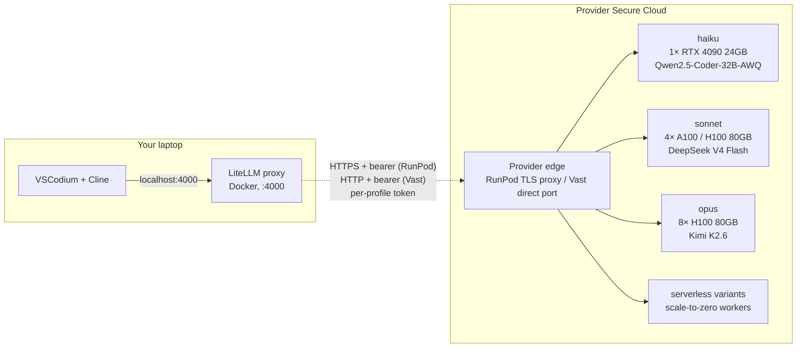

# zdr-coder

[](LICENSE)
[](#what-zdr-means-here)
[](#what-zdr-means-here)

**Self-hosted Claude-Code-equivalent agentic coding inside VSCodium, with zero data retention.** One-line deploy. Cline talks to an open-source model running on rented GPUs in an ISO 27001 / Tier 3-4 datacenter, with TLS to the provider edge and a per-pod bearer token. No third-party model provider. Choose your GPU provider — **Vast.ai Secure Cloud** (cheaper, more on-demand capacity) or **RunPod Secure Cloud** (the original path) — and mix per-tier freely.

## Three profiles, two providers, two compute modes

Pick a **profile** (haiku / sonnet / opus = small / medium / frontier model). Pick a **provider** (Vast.ai Secure Cloud or RunPod Secure Cloud). Pick a **compute mode** (always-on **pod** for predictable latency, or **serverless** for pay-per-second with scale-to-zero).

| Profile | Closest Claude | Open-source model | Weights | GPU shape |
|---|---|---|---|---|
| **haiku** | Haiku 4.5 | Qwen2.5-Coder-32B-AWQ | 18 GiB INT4 | 1× 24 GB (RTX 4090) |
| **sonnet** *(default)* | Sonnet 4.6 | DeepSeek V4 Flash | 149 GiB FP8 | 4× A100-SXM4 80GB (or 4× H100 80GB) |
| **opus** | Opus 4.7 | Kimi K2.6 | 554 GiB mixed | 8× H100-SXM 80GB |

GPU shapes are sized to fit each model's weights plus KV-cache headroom for a useful context window. Tune via env: `GPU_TYPE_ID`/`GPU_NAME`, `GPU_COUNT`/`NUM_GPUS`, `TP_SIZE`, `MAX_LEN`.

Run any combination in parallel against the same local LiteLLM endpoint and switch between them in Cline by changing the Model ID. Available model IDs out of the box:

```
haiku             haiku-vast              haiku-serverless
sonnet            sonnet-vast
opus              opus-vast
```

(plain name = RunPod pod, `-vast` = Vast.ai Secure Cloud pod, `-serverless` = RunPod Serverless.)

## Cost comparison — live snapshot, May 2026

Always-on pod pricing for our three shapes, per current available on-demand offer:

| Tier | RunPod Secure $/hr | Vast Secure Cloud $/hr | Notes |
|---|---|---|---|
| haiku (1× RTX 4090 24GB) | $0.69 | **$0.40–0.67** | Vast cheapest when an Iceland host is rentable, otherwise UK/HU ~$0.67 |
| sonnet (4× A100-SXM4 80GB or 4× H100 SXM) | $5.96 (often sold out) | **$4.27** (A100) or **$5.87** (H100 SXM) | Vast supply varies hour-to-hour; only 1–2 hosts at a time |
| opus (8× H100 SXM 80GB) | $23.92 (often sold out) | **$11.74** | France datacenter, when listed |
| opus *(alt)* 4× H200 140GB | — | **$7.74** | 560 GiB total > Kimi K2.6's 554 GiB weights |

Serverless (pay-per-second of actual GPU usage, $0 idle):

| Tier | RunPod Serverless | Vast Serverless | Notes |
|---|---|---|---|
| haiku | ~$0.50/hr while running, $0 idle | ~$0.40–0.67/hr while running | Cold start ~3–5 min on RunPod (lazy vLLM init); Vast similar |
| sonnet | not wired today | not wired today | Both providers support the workflow; needs a script. Tracked in TODO. |
| opus | not wired today | not wired today | Same. |

**TL;DR**: Vast.ai Secure Cloud beats RunPod on price across all three tiers when capacity is available — but the 80 GB datacenter market is thin on both providers today. Mix-and-match per-tier is the practical pattern.

Run any one, or all combinations in parallel; switch between them in Cline by changing the Model ID.

## Architecture



- **LiteLLM** = local OpenAI-compatible proxy. Routes per-profile aliases, holds the master API key, injects per-route bearer tokens.
- **RunPod edge** = `https://<pod-id>-8000.proxy.runpod.net`, TLS-terminated by RunPod. Bearer auth between LiteLLM and vLLM.
- **Vast.ai edge** = direct port-forward to the host, `http://<host-ip>:<host-port>`. Bearer auth required (HTTP — see caveats).
- **vLLM** = OpenAI-compatible model server. Serves `/v1/chat/completions` and friends.
- **Cline** = the agentic coding extension in VSCodium. Talks to LiteLLM on localhost.

There is no mesh VPN. The earlier WireGuard-based design was dropped in favor of provider-managed transport (TLS or direct port-forward) + bearer tokens — same E2E security envelope, simpler to operate.

## What ZDR means here

There is no managed model provider in the inference path. Both supported providers — Vast.ai Secure Cloud and RunPod Secure Cloud — are ISO 27001 / Tier 3-4 datacenter operators with signed Data Processing Agreements; on Vast the script filters `datacenter: {eq: true}` to stay in that tier and never lands on the marketplace. LiteLLM is configured with `turn_off_message_logging: true` and `disable_spend_logs: true`. Prompts never touch a third party.

For HIPAA: both providers offer BAA-eligible Secure Cloud.
- **RunPod**: email `support@runpod.io` — 1–2 business days, no Enterprise contract required.
- **Vast.ai**: BAAs are available for qualifying customers on the Secure Cloud tier; request via their account portal.

## Quickstart — resume after a break

If you've used this repo before (keys/state preserved in `.env` and `.litellm-key`), one command per tier:

```bash
# haiku-tier: $0.30–0.67/hr (RTX 4090, 32B coder model)
VAST_ALLOW_MARKETPLACE=1 MAX_LEN=16384 ./scripts/deploy-vast.sh haiku

# sonnet-tier: $5.87–$11.42/hr (4× H100 SXM, DeepSeek V4 Flash 158B FP8)
VAST_ALLOW_MARKETPLACE=1 ./scripts/deploy-vast.sh sonnet

# point Cline at http://localhost:4000/v1 with API key from `cat .litellm-key`
# Model ID = haiku-vast or sonnet-vast — switch mid-session

# end of day:
./scripts/destroy.sh all
```

That deploys, validates with a smoke test, recreates LiteLLM, and prints the Cline config. Cold-start is ~15 min the first deploy of the day (image pull + model download). Stop everything cleanly with `./scripts/destroy.sh all` — verify with `curl -sS https://console.vast.ai/api/v0/instances/ -H "Authorization: Bearer $VAST_API_KEY" | jq '.instances | length'` (should return 0).

**Verified end-to-end as of this commit**: `haiku-vast` (RTX 4090) and `sonnet-vast` (4× H100 SXM, US marketplace host). The flags `VAST_ALLOW_MARKETPLACE=1` and `MAX_LEN=16384` for haiku are required today — Vast's Secure Cloud (datacenter:true) 4-GPU 80GB tier is too thin for sonnet/opus, and the default 4K context is too tight for Cline's system prompt. Drop them if SC capacity returns.

For opus you'll want to use `./scripts/vol-up.sh opus` first (one-time ~$6 to pre-populate the 554 GiB Kimi K2.6 weights onto a persistent volume), then `./scripts/deploy-vast.sh opus` for the actual session — see [Persistent model cache](#persistent-model-cache-volumes--opus-economics) below.

## Setup

### 1. Install prerequisites — one command

```bash
# macOS or Ubuntu/Debian
./scripts/install-prereqs.sh
```

```powershell
# Windows (PowerShell as Administrator)
.\scripts\install-prereqs.ps1
```

Installs Docker, jq, openssl, flock, VSCodium, and the Cline extension. macOS uses Homebrew, Ubuntu/Debian uses apt, Windows uses Chocolatey. Skips anything already installed.

> **Windows note:** the deploy/destroy/smoketest scripts are bash. Run them via WSL2 (recommended — Docker Desktop on Windows uses WSL2 anyway) or Git Bash.

### 2. Get a provider API key

Pick one (or both — you can mix per-tier).

**Vast.ai (recommended — cheaper, more on-demand capacity):**

1. Sign up at https://cloud.vast.ai/ (credit card, no sales contact — "Reserved" tier is the only one that's sales-gated and we don't use it).
2. https://cloud.vast.ai/account/ → **Create API Key** → **Advanced** tab.
3. Grant the minimum permissions our script uses:

   | Permission | Set to | Why |
   |---|---|---|
   | **User** | Read | Some endpoints resolve account context from the token |
   | **Instances** | **Read + Write** | Required — script creates, polls, and deletes instances |
   | Billing/Earning | *neither* | We never query billing; principle of least privilege |
   | Miscellaneous | Enabled (default) | Fine |
   | **2FA** | **Off** (don't require) | Programmatic key for unattended scripts; 2FA would break it |

4. Vast shows the key string **once at creation** — copy it immediately into `.env` as `VAST_API_KEY=…`. If you lose it, delete the key and create a new one.

**RunPod (original path — pods + serverless, currently low 80GB capacity):**

1. https://console.runpod.io/user/settings → **API Keys** → **Create API Key**.
2. **Permissions: All** (full read/write to `api.runpod.io/graphql` *and* `api.runpod.ai`). The "Restricted" scope works for the pod path but returns **403** against the serverless `/openai/v1` inference endpoint — pick **All** if you want both paths to work.
3. Copy key into `.env` as `RUNPOD_API_KEY=…`. Add credits to the account.

### 3. Configure & deploy

```bash
cp .env.example .env
$EDITOR .env             # set VAST_API_KEY and/or RUNPOD_API_KEY
```

**Vast.ai path (recommended):**

```bash
./scripts/deploy-vast.sh haiku           # 1× RTX 4090, ~$0.40–0.67/hr
./scripts/deploy-vast.sh sonnet          # 4× A100/H100 80GB
./scripts/deploy-vast.sh opus            # 8× H100 80GB
```

**RunPod path (fallback / serverless):**

```bash
./scripts/deploy.sh haiku                # 1× 24GB always-on pod
./scripts/deploy.sh sonnet               # 4× A100-SXM4 80GB always-on
./scripts/deploy.sh opus                 # 8× H100 80GB always-on
./scripts/deploy-serverless.sh haiku     # scale-to-zero serverless variant
```

Run multiple in parallel (parallel cold start, ~15-20 min wall time vs serial):

```bash
./scripts/deploy-vast.sh haiku &  ./scripts/deploy.sh sonnet &  wait
# — or in separate terminals for cleaner logs.
```

Each deploy provisions one pod/endpoint, generates its own bearer token, and exposes a separate model alias in LiteLLM. All share `http://localhost:4000` — switch between them in Cline by changing the **Model ID**:

```
haiku | sonnet | opus                                  ← RunPod pods
haiku-vast | sonnet-vast | opus-vast                   ← Vast.ai Secure Cloud pods
haiku-serverless                                       ← RunPod Serverless
```

When you're done coding:

```bash
./scripts/destroy.sh                     # tears down everything across both providers
./scripts/destroy.sh sonnet-vast         # one tier
./scripts/destroy.sh haiku-serverless    # one serverless endpoint
```

Pod termination stops billing within ~1 minute. Serverless `workersMin=0` means idle cost is already $0; teardown deletes the endpoint + template.

### 4. Point Cline at it

The deploy script prints these — paste into VSCodium → Cline → gear:

- **API Provider**: OpenAI Compatible
- **Base URL**: `http://localhost:4000/v1`
- **API Key**: contents of `.litellm-key` (auto-generated on first deploy)
- **Model ID**: `sonnet` (or `haiku` / `haiku-serverless` / `opus`)

To swap between models mid-session: change the **Model ID** field. No restart, no redeploy.

## Persistent model cache (volumes) — opus economics

The 554 GiB Kimi K2.6 download dominates an opus cold-start. To avoid re-downloading on every deploy, pre-populate a Vast.ai data volume once and mount it on every subsequent deploy.

```bash
# Day 1 morning — populate volume (one-time ~1-2 hr download)
./scripts/vol-up.sh opus
# (volume now persists. Storage bills ~$0.05/GB/mo, prorated to the second.)

# Each subsequent day:
./scripts/deploy-vast.sh opus       # 3-5 min cold start, mounts volume
# ...code...
./scripts/destroy.sh opus-vast      # stops compute. Volume stays.

# End of project (1 day, 1 week, whenever):
./scripts/vol-down.sh opus          # storage billing stops
```

How the cost works for a typical month of opus use (4 hrs/day, 20 workdays, volume kept overnight):

| Component | Cost |
|---|---|
| One-time populate (~1 hr compute + Vast volume creation) | ~$6 |
| Volume storage (800 GB × ~$0.05/GB/mo) | ~$40/mo |
| Active opus compute (20 × 4 hrs × $11.74/hr on Vast 8× H100 France) | ~$940/mo |
| **Total self-hosted opus** | **~$986/mo** |

Versus Anthropic Opus 4.7 API at typical agentic-coding token mix (~10K input / 2K output per step, ~100 steps/hr, ~$30/hr):

| 80 hrs/mo of Opus use | Self-hosted | Anthropic | Savings |
|---|---|---|---|
| Opus | $986 | $2,400 | **~60%** |
| Sonnet (4× A100 $3.28/hr × 80 hrs) | $263 | $480 | ~45% |
| Haiku (1× 4090 $0.40/hr × 80 hrs) | $32 + LiteLLM | ~$70 | break-even |

Crossover for opus is ~**1.5 hrs/day of active use**. Below that, Anthropic API is cheaper for the convenience.

**Caveat**: Vast volumes are pinned to a specific `machine_id`. If that host disappears (operator takes it offline), the volume is unavailable until it comes back — `deploy-vast.sh` fails fast in that case. For multi-week reliability, prefer RunPod network volumes (region-scoped, not host-pinned); RunPod equivalent isn't wired in this repo yet — tracked.

## Pod vs Serverless — when each wins

|  | **Pod (always-on)** | **Serverless (scale-to-zero)** |
|---|---|---|
| Idle cost | $0.40–$23.92/hr always-on | $0/hr |
| Active cost | included | per-second of worker uptime / execution |
| First request after idle | instant (host stays warm) | ~3–5 min cold-start (worker spawns, vLLM lazy-inits, model loads to GPU) |
| One-time cold start | ~10–15 min first deploy | ~5–10 min first request |
| Capacity risk | Subject to GPU supply per pool/region | Provider auto-pools across hosts |
| Best for | 4+ hrs/day continuous coding | Bursty, intermittent, demos, occasional use |

If you code 6+ hrs/day on the same tier: **pods**. If you code 1–2 hrs/day or intermittently: **serverless**. Rule of thumb: serverless wins when `(hours/day) × ($/hr) < ($/hr × 24)` — anything below ~10 hrs/day favors serverless for the cheapest tier; tighter for opus where idle cost dominates.

## Things we learned the hard way

Field-tested gotchas baked into the scripts as comments + filters; for users of the scripts these are *not* surprises:

- **Vast `verified` ≠ datacenter.** `verified: {eq: true}` is "host passes basic reliability checks" (marketplace tier, Docker-only isolation). The actual ZDR/HIPAA filter is `datacenter: {eq: true}` (ISO 27001, Tier 3/4, BAA-eligible). `deploy-vast.sh` hardcodes the latter.
- **Vast rents whole hosts.** Search must use `num_gpus: {eq: N}`, not `gte: N` — otherwise picking an 8-GPU host for a 4-GPU TP config double-bills you.
- **CUDA forward-compat doesn't work on consumer Ada.** `vllm/vllm-openai:latest` currently ships CUDA 12.8+. RTX 4090 hosts with driver < 580 (cuda_max_good < 13.0) fail with `cudaInit error 804: forward compatibility was attempted on non supported HW`. Filter forces `cuda_max_good: {gte: 13.0}` to skip them. Long-term fix: pin our `gpu-node/Dockerfile` to a vLLM tag with older CUDA so the cheap driver-565 market becomes accessible.
- **`runpod/worker-v1-vllm` has no `:stable` or `:latest` tag.** Only versioned tags (`:v2.18.1` etc.). `:stable` silently stalls worker initialization forever. `deploy-serverless.sh` pins to a known good version.
- **RunPod's `Restricted` API-key scope returns 403 on `/v2/<id>/openai/v1`.** Pick **All** scope for serverless inference — basic pod management would otherwise work but the inference path won't.
- **Plain HTTP transport on Vast.** Vast direct-port-forwarding gives `http://<host>:<port>`, not HTTPS. The bearer token in `.vllm-key.<profile>-vast` is the only thing keeping the endpoint private. Adequate for personal coding given the bearer; for full TLS, run a Caddy/Cloudflared sidecar. Filed as a future improvement.
- **Some multi-GPU Vast hosts have a broken CDI runtime.** A subset of Vast Secure Cloud hosts (seen on Japan A100 SXM4 and Texas Blackwell PRO 6000 S) fail container creation with `OCI runtime create failed: failed to inject CDI devices: unresolvable CDI devices`. The host's NVIDIA Container Toolkit can't pass GPUs through. Tear down and pick a different operator; the bug is per-host, not provider-wide.
- **Vast Serverless** exists at https://docs.vast.ai/guides/serverless but isn't wired in this repo yet. Their model is Python-SDK + `@app.remote()` handlers (different from the shell-script container model), not a thin flag on top of pods. Tracked as a follow-up PR.

## How `zdr-coder` compares to similar projects

| Project | Closeness | Differs |
|---|---|---|
| [Leafcloud `tf-leafcloud-opencode`](https://docs.leaf.cloud/en/latest/private-llm/team-opencode-vllm/) | ~70% | OpenCode TUI (not Cline), CIDR allowlist, Leafcloud-only, no BAA |
| OpenClaw + vLLM on Vast.ai / Salad | ~65% | OpenClaw runtime, no LiteLLM Anthropic shim |
| [Netclode](https://github.com/angristan/netclode) | ~55% | Mobile/iOS client, Ollama not vLLM, k3s + microVM-per-session |
| ZeroClaw + LiteLLM + vLLM in Docker | ~50% | DGX Spark focus, ZeroClaw not Cline |
| BentoVLLM / OpenLLM | ~50% | Just the "model → OpenAI endpoint" piece |

**The differentiation**: nobody else ships VSCodium + Cline + LiteLLM + rented-GPU vLLM + a *serverless mode option* + HIPAA-eligible host as a single one-line-deploy template.

## Caveats

- **BAA is a separate process on both providers.** RunPod: email `support@runpod.io` (1–2 business days). Vast.ai: request via account portal on the Secure Cloud tier.
- **Cold start is slow.** Pods: ~10–20 min for haiku/sonnet; ~20–30 min for opus (Kimi K2.6 weights are large). Serverless: ~3–5 min on first request after scale-to-zero. Run profiles in parallel to overlap warmups.
- **80 GB datacenter supply is thin on both providers.** Sonnet (4× A100/H100 80GB) and opus (8× H100 80GB) Secure-Cloud inventory rotates hourly — sometimes there's 1–2 candidate hosts, sometimes none. Have a fallback plan; `GPU_NAME="H200"` is one for sonnet.
- **No persistent vLLM cache by default.** Weights re-download on every fresh pod. Both providers support persistent volumes if you want to keep them.
- **Hugging Face anonymous access.** Models like Qwen2.5-Coder-32B-AWQ and DeepSeek V4 Flash work without a token. Gated models need `HF_TOKEN` in `.env`.
- **Parallel mode billing.** All three pod profiles running ≈ ~$18-30/hr (haiku $0.40 + sonnet $4-6 + opus $12-24). Stop tiers you aren't testing with `./scripts/destroy.sh <profile>`.

## Files

```
.
├── README.md
├── LICENSE                       # MIT
├── docker-compose.yml            # LiteLLM container only
├── litellm/config.yaml           # model routes (haiku/sonnet/opus + serverless + heavy/plan)
├── gpu-node/
│   ├── Dockerfile                # vLLM image
│   └── start.sh                  # container entrypoint
├── scripts/
│   ├── install-prereqs.sh        # macOS/Linux installer (Homebrew/apt)
│   ├── install-prereqs.ps1       # Windows installer (Chocolatey, PowerShell)
│   ├── deploy.sh                 # RunPod pod deploy (per profile or all)
│   ├── deploy-vast.sh            # Vast.ai pod deploy (per profile)
│   ├── deploy-serverless.sh      # RunPod Serverless deploy (haiku today)
│   ├── vol-up.sh                 # create + populate a Vast persistent volume
│   ├── vol-down.sh               # delete a Vast persistent volume
│   ├── destroy.sh                # teardown (any profile across providers)
│   ├── preflight.sh              # validates prereqs + .env
│   └── smoketest.sh              # end-to-end path test (per profile)
├── .github/workflows/            # auto-builds GPU image to GHCR
├── .env.example                  # 1 required value
└── .gitignore
```

## Troubleshooting

**`smoketest.sh` returns FAIL** — read its output; it names the broken hop.

**`403 Forbidden` from `/v2/<id>/openai/v1`** — your `RUNPOD_API_KEY` is "Restricted" scope. Serverless inference needs "All" or "Read/Write". Create a new key in the RunPod console with full scope and update `.env`.

**Serverless worker stuck "initializing" with no logs** — your template image tag doesn't exist. `runpod/worker-v1-vllm` only ships versioned tags (`:v2.18.1` etc.) — there is no `:stable` or `:latest`. Update the template.

**vLLM "out of memory"** — shrink `MAX_LEN` for the profile, or lower `GPU_UTIL`. Haiku at MAX_LEN=8K already exhausts KV cache margin on 24 GB after CUDA-graph capture overhead; the default is 4K for that reason.

**Serverless worker dies with `CUDA initialization failed: out of memory` during fitness check** — host-level GPU has stale allocations from a prior worker. RunPod usually re-schedules; if it loops, exclude the specific GPU pool (e.g. drop `AMPERE_24` from `gpuIds` to skip A5000/3090 hosts) and the next worker will land elsewhere.

**Cold-start request hits Cloudflare 524** — the sync `/openai/v1` path has a ~600s edge timeout. The worker is fine; subsequent requests will succeed once it finishes warming. Or use the async `/run` + `/status` API for very long warmups.

**Vast deploy reaches "RUNNING" but vLLM crashes with `cudaInit error 804: forward compatibility was attempted on non supported HW`** — the host's NVIDIA driver is older than our container's CUDA libs, and consumer Ada GPUs (RTX 4090) don't get CUDA forward-compat. Bump the script's `cuda_max_good` filter higher, or rebuild `gpu-node/Dockerfile` from a vLLM tag that pins an older CUDA. The shipped filter is `≥ 13.0`.

**Vast instance picks an offer but stalls on "Pulling fs layer" indefinitely** — host network can't reach GHCR (typical of CN-located hosts). Add a `geolocation` exclusion or raise `inet_down` minimum. The shipped script enforces `inet_down ≥ 500` Mbps.

**Vast picks an 8-GPU host when you only need 4** — Vast rents whole hosts. The script uses `num_gpus: {eq: N}` (not `gte`) precisely to avoid this. If you override the search yourself, mirror that.

## Reporting vulnerabilities

Open a private security advisory on this repository's GitHub Security tab. No bounty program; we aim to respond within 5 business days.

## License

MIT — see [LICENSE](LICENSE).
