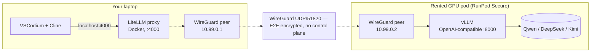

# zdr-coder

[](LICENSE)
[](#what-zdr-means-here)
[](https://www.runpod.io/press/runpod-meets-hipaa-and-gdpr-standards)

**Self-hosted Claude-Code-equivalent agentic coding inside VSCodium, with zero data retention.** One-line deploy. Cline talks to your own open-source model on rented GPUs over a private WireGuard tunnel. No third-party model provider, no Tailscale cloud, no Cloudflare, no Hugging Face token — just RunPod for the GPU.

## Three profiles, one variable to switch

| Profile | Closest Claude | Open-source model | GPU shape | $/hr | $/mo @ 80 h |
|---|---|---|---|---|---|
| **haiku** | Haiku 4.5 | Qwen3-Coder-32B | 1× RTX A5000 24GB | **$0.27** | $22 |
| **sonnet** *(default)* | Sonnet 4.6 | DeepSeek V4 Flash | 2× A100 SXM 80GB | **$2.98** | $238 |
| **opus** | Opus 4.7 | Kimi K2.6 INT4 | 8× H100 SXM | **$23.92** | $1,914 |

## Architecture



- **WireGuard** = direct peer-to-peer E2E-encrypted UDP. No control plane, no Tailscale cloud, no Headscale, no Cloudflare. Just two endpoints exchanging public keys.
- **LiteLLM** = local OpenAI-compatible proxy. Routes per-mode aliases, holds master API key.
- **vLLM** = OpenAI-compatible model server. Downloads weights from HF-Mirror (no token) by default.
- **Cline** = the agentic coding extension in VSCodium. Talks to LiteLLM on localhost.

## What ZDR means here

There is no managed model provider in the path. The WireGuard tunnel is E2E encrypted between exactly two endpoints (your laptop and your GPU pod). LiteLLM is configured with `turn_off_message_logging: true` and `disable_spend_logs: true`. Nothing about your prompts touches a third party.

For HIPAA: RunPod offers BAA-eligible Secure Cloud — email `support@runpod.io` to execute (1–2 business day turnaround, no Enterprise contract required).

## Setup

Just three things to do:

### 1. Get a RunPod API key

https://www.runpod.io/console/user/settings → API Keys → Create. Add credits to your account.

### 2. Install prerequisites

- **Docker** — https://docker.com
- **WireGuard tools** — `brew install wireguard-tools` (macOS) or `apt install wireguard-tools` (Linux)
- **VSCodium** + **Cline** extension — https://open-vsx.org/extension/saoudrizwan/claude-dev

### 3. Configure & deploy

```bash
cp .env.example .env
$EDITOR .env             # set RUNPOD_API_KEY (only required value)
./scripts/deploy.sh      # one command does everything
```

`deploy.sh` generates WireGuard keypairs, provisions a RunPod Secure pod with the GPU keypair + your public key as env vars, discovers the pod's public IP, writes the laptop-side `wg/laptop.conf`, brings up local LiteLLM + WireGuard via docker-compose, waits for vLLM warmup (~10–20 min cold), and runs the end-to-end smoketest.

When you're done coding:

```bash
./scripts/destroy.sh     # terminates pod (billing stops in ~1 min) + stops local stack
```

### 4. Point Cline at it

The deploy script prints these — paste into VSCodium → Cline → gear:

- **API Provider**: OpenAI Compatible
- **Base URL**: `http://localhost:4000/v1`
- **API Key**: from `.litellm-key` (auto-generated on first deploy)
- **Model ID**: `heavy`

## Switching profiles

Uncomment one of the `haiku` / `sonnet` / `opus` blocks in `.env`, then:

```bash
./scripts/destroy.sh && ./scripts/deploy.sh
```

## How `zdr-coder` compares to similar projects

| Project | Closeness | Differs |
|---|---|---|
| [Leafcloud `tf-leafcloud-opencode`](https://docs.leaf.cloud/en/latest/private-llm/team-opencode-vllm/) | ~70% | OpenCode TUI (not Cline), CIDR allowlist (not WG), Leafcloud-only, no BAA |
| OpenClaw + vLLM on Vast.ai / Salad | ~65% | OpenClaw runtime, no LiteLLM Anthropic shim, no mesh networking |
| [Netclode](https://github.com/angristan/netclode) | ~55% | Mobile/iOS client, Ollama not vLLM, k3s + microVM-per-session |
| ZeroClaw + LiteLLM + vLLM in Docker | ~50% | DGX Spark focus, no WG, ZeroClaw not Cline |
| BentoVLLM / OpenLLM | ~50% | Just the "model → OpenAI endpoint" piece |

**The differentiation**: nobody else ships specifically *VSCodium + Cline + LiteLLM + pure WireGuard (no control plane) + rented-GPU template + HIPAA-eligible host*. Position is compliance-grade Claude Code in 30 minutes on rented GPUs with peer-to-peer mesh.

## Caveats

- **RunPod BAA is a separate process.** Email `support@runpod.io` if you need it — 1–2 business days, no Enterprise commitment.
- **Cold start is slow.** ~10–20 min for sonnet/haiku; ~20–30 min for opus (Kimi K2.6 weights are large). Keep the node up during a work session, destroy overnight.
- **No persistent vLLM cache by default.** Weights re-download on every fresh pod. RunPod supports persistent volumes if you want to keep them.
- **HF-Mirror is community-run.** Reliable for most public models. If a model isn't mirrored, set `HF_TOKEN` in `.env` to fall back to the original HF (some models still need license acceptance there).

## Files

```
.
├── README.md
├── LICENSE                    # MIT
├── docker-compose.yml         # WireGuard peer + LiteLLM (laptop)
├── litellm/config.yaml        # model routes
├── gpu-node/
│   ├── Dockerfile             # vLLM + wireguard-tools image
│   └── start.sh               # container entrypoint
├── scripts/
│   ├── deploy.sh              # one-line deploy
│   ├── destroy.sh             # one-line teardown
│   ├── preflight.sh           # validates prereqs + .env
│   └── smoketest.sh           # end-to-end path test
├── wg/                        # generated WG config (gitignored)
├── .env.example               # 1 required value
└── .gitignore
```

## Troubleshooting

**`smoketest.sh` returns FAIL** — read its output; it names the broken hop.

**WireGuard handshake doesn't happen** — `docker compose exec wg-laptop wg show wg0` shows the peer with `latest handshake` once it's working. If empty, the GPU pod's UDP port may not be exposed properly. Check the RunPod console for the pod's port mappings.

**vLLM "out of memory"** — shrink `MAX_LEN` or lower `--gpu-memory-utilization` to `0.88` in `gpu-node/start.sh`.

**Model download fails from HF-Mirror** — set `HF_TOKEN=hf_...` in `.env` to fall back to the original HuggingFace.

**`wg` not found** — `brew install wireguard-tools` (macOS) or `apt install wireguard-tools` (Linux).

## Reporting vulnerabilities

Open a private security advisory on this repository's GitHub Security tab. No bounty program; we aim to respond within 5 business days.

## License

MIT — see [LICENSE](LICENSE).
