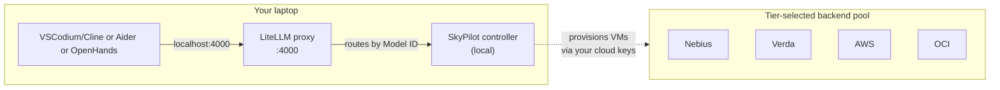

# zdr-coder

[](LICENSE)
[](COMPLIANCE.md)
[](COMPLIANCE.md)

**Self-host your AI coding assistant with verifiable ZDR.** Open-weights models (DeepSeek V4 Pro, GLM-4.5-Air, Qwen3-Coder, GPT-OSS) on rented GPU, behind one local OpenAI-compatible proxy. One config picks your compliance/cost tier; SkyPilot[^skypilot] aggregates supply across providers and fails over automatically.

> **Never used a terminal?** Jump to [📚 If you've never used a terminal](#-if-youve-never-used-a-terminal-read-this-first).

## 5-minute setup

```bash
# 1. Run the interactive setup (creates venv, installs SkyPilot, prompts you per backend)
./scripts/setup.sh

# 2. Start the local proxy + agent
./start.command  (mac) | ./start.bat  (win) | ./scripts/api-up.sh  (linux)

# 3. Use it
open http://localhost:3000                   # OpenHands (browser) — or point Cline/Aider at :4000
```

The setup script reads `ZDR_TIER` from `.env` (defaults to `soc2`) and walks you through web signups + key paste for the backends that tier needs. Each prompt is **Y / n** — pressing `n` skips for this run; re-run `./scripts/setup.sh` any time to add a backend later.

## Pick your path

Two orthogonal axes: **what models you want** and **what compliance you need**. Most users only need the first.

### Path 1: Managed APIs (recommended for non-devs and anyone not needing self-hosted opus)

No GPU provisioning, no quota requests. Sign up, paste key, done. Both options are wired in the repo.

| Goal | Backend | Setup | Cost | Compliance |
|---|---|---|---|---|
| Cheapest, ZDR-eligible | **Groq API** (Level 3) — `haiku-api` + `sonnet-api` | https://console.groq.com → API Keys → toggle ZDR | $0 idle, ~$0.10–$0.20/hr active | SOC 2 Type II + ISO 27001 + HIPAA-BAA-eligible |
| Signed BAA right now, click-through | **AWS Bedrock** (Level 4) — managed Claude/Llama | https://console.aws.amazon.com/bedrock → accept BAA in AWS Artifact → enable model access | ~$3–$15 per million tokens | Full AWS stack: SOC 2 + ISO 27001/17/18 + FedRAMP + HITRUST + signed BAA |

Bedrock is the BAA path with **no GPU quota dance** — it's a managed API, not EC2, so you skip the entire GPU-acquisition problem. Pick Groq unless your compliance team specifically requires a vendor-signed BAA.

### Path 2: Self-hosted on rented GPU (this is where the tier picker matters)

Pick this if you want **opus-class** (DeepSeek V4 Pro, Kimi K2.6) under ZDR, or want to run *your* container instead of someone else's API. One env var picks the SkyPilot backend pool; SkyPilot handles failover.

**This repo is sales-free by design.** Every wired backend is web signup + CLI keys — no calls, no demos, no contracts. Providers whose BAA is sales-gated (CoreWeave, OCI, Vast/RunPod Secure) are listed in [COMPLIANCE.md](COMPLIANCE.md) but **not** wired into a default tier; configure them as a one-off override if you genuinely need their BAA.

| `ZDR_TIER` | Compliance posture | Backends configured | Cost/hr (opus tier) | Sales call? | When to pick |
|---|---|---|---|---|---|
| `cheap` | None — marketplace | Vast.ai + RunPod Community | $20.71–$35.12 | ❌ Never | Personal / non-regulated, fast iteration |
| `soc2` ⭐ default | SOC 2 Type II + ISO 27001 | **Nebius + Verda + RunPod Community** | $26–$36 | ❌ Never (web + CLI keys) | Most businesses; instant on/off, per-second billing |
| `hipaa` | BAA-signed via self-serve click-through | **AWS + Azure** | $55–$110 | ❌ Never (BAA self-serve in console) | Healthcare/PHI. ⚠️ Both need GPU quota request forms (no calls, but 1–4 day approval) |

Why `soc2` is the default: Nebius includes HIPAA in its SOC 2 Type II scope[^nebius-trust] (rare for a neocloud), Verda gives EU-sovereign redundancy[^verda-faq] with a clean 4× H200 SKU at $16/hr, and RunPod Community covers US + small 1× SKUs for haiku tier. All three are instant-on (~30–90s), instant-off (~10–30s), per-second billed, zero human contact.

`hipaa` carries real friction: AWS p5e/p5en need GPU quota approvals (default = 0) via a web form, and Capacity Block reservations are pre-paid 1-day-minimum windows. The BAA itself is click-through. **If you need a BAA without the quota dance, use AWS Bedrock (Path 1).**

### Pick your privacy level

This repo gives you **Level 3** (Groq API + ZDR) and **Level 6** (self-hosted on rented GPU). The full Level 1–6 comparison (consumer chat → confidential compute → own-everything) and the verbatim compliance citations for every claim live in **[COMPLIANCE.md](COMPLIANCE.md)** — read it before betting compliance on a tier. The short version of the decision tree:

- Personal, not regulated → `cheap`
- A business product, not touching healthcare/finance/gov data → `soc2` ⭐
- Touching ANY US healthcare data (PHI) → you legally need `hipaa` or stronger
- Federal contract → add Azure + OCI for FedRAMP

`soc2` ⊆ `hipaa` ⊆ `fedramp`: the tiers stack. You can move up later by swapping the `.env` config; SkyPilot lets you change backends without touching your model setup.

## Known issues (save yourself an afternoon)

- **Nebius declines US-issued cards** at signup (Stripe declines even with travel notice + international txns on — seen with BofA and Citi). Use a Wise/Revolut card, or just `skip` Nebius and run Verda + RunPod (2-way failover is fine).
- **AWS GPU quota (p5/p5e/p5en) defaults to 0** on new accounts; 1–4 day approval via the quota form, and it's **per-region** — a single approval is not global. For fast on-instance compliance use Bedrock (Path 1) instead.
- **AWS Bedrock model access** is per-account: Llama/Mistral instant, Anthropic Claude needs a one-time request form (~1 hr).
- **Pin vLLM to `v0.10.0`.** `vllm/vllm-openai:latest` needs CUDA driver 12.9+, which Lambda's hosts don't have; v0.10.0 supports driver 12.4+. Already pinned in the `sky/*.yaml` configs.
- **Vast.ai port-forward is plain HTTP** (auto-forwards only port 8080, via `ssh_host:ssh_port+1`); bearer token is the only auth. All sky configs use 8080 — don't change it without reconfiguring Vast. Add a Caddy/Cloudflared sidecar for TLS.
- **RunPod via SkyPilot = Secure Cloud only** (CA/T3-T4 DCs; catalog ships only `_SECURE` types). Community Cloud isn't reachable via SkyPilot. Good for compliance, no config needed.
- **Verda has no `open_ports`** (breaks all 6 port-exposing sky configs) and no 1× L40S SKU — it's used only as a non-port fallback; for haiku use RunPod or Lambda 1× A100.
- **OCI has no `docker_image` support** in SkyPilot, so it's excluded from the YAMLs' backend pools.

## Available model IDs

LiteLLM proxies your client requests to the right backend. Switch by changing the **Model ID** — no restart.

| Model ID | What runs | Replica policy | Backend (per tier) | Cost/hr |
|---|---|---|---|---|
| `haiku-api` | GPT-OSS 20B (Groq) | always-warm | Groq Cloud (Level 3) | $0.10 active, $0 idle |
| `sonnet-api` | GPT-OSS 120B (Groq) | always-warm | Groq Cloud (Level 3) | $0.20 active, $0 idle |
| `opus-bedrock` / `opus-glm` / `opus-claude` | Managed opus-class (AWS Bedrock) | scale-to-zero | AWS Bedrock (Level 4) | ~$3–$15/M tokens |
| `haiku-pod` | Qwen3-Coder-30B-A3B-Instruct-FP8 (~30 GB) | `min_replicas: 1` | SkyPilot, tier-selected | $1.37–1.90 |
| `sonnet-pod` | **GLM-4.5-Air** (106B/12B MoE, MIT) | `min_replicas: 1` | SkyPilot, tier-selected | $10–14 (4× H100) or ~$4 (1× H200 FP8) |
| `opus-pod` | **DeepSeek V4 Pro** (1.6T/49B MoE, MIT, needs 8× H200) | `min_replicas: 1` | SkyPilot, tier-selected | $22–32 |
| `haiku-serve` | Qwen3-Coder-30B-A3B-Instruct-FP8 | `min_replicas: 0` | SkyPilot serve, scale-to-zero | $0 idle, ~$1.50 active (cold ~60–90s) |
| `sonnet-serve` | GLM-4.5-Air | `min_replicas: 0` | SkyPilot serve, scale-to-zero | $0 idle, ~$10 active (cold ~90s FP8) |
| `opus-serve` | DeepSeek V4 Pro (8× H200 only) | `min_replicas: 0` ⚠️ | SkyPilot serve, scale-to-zero | $0 idle, ~$28 active (cold ~4–6 min — see [opus cold start](#opus-cold-start)) |

Switching is instant — change the field in Aider (`ZDR_MODEL=...`), Cline (Model ID), or `/model` in Hermes.

### Honest tier mapping vs Claude

| Want | Route | Real cost | Performance vs Claude |
|---|---|---|---|
| Haiku-class, cheapest | `haiku-api` (GPT-OSS 20B, Groq) | $0.10 active, $0 idle | Comparable for simple edits; coding-tuned |
| Sonnet-ish, managed | `sonnet-api` (GPT-OSS 120B, Groq) | $0.20 active, $0 idle | Between Sonnet 3.5 and Sonnet 4 |
| Sonnet-class, self-hosted | `sonnet-pod` (GLM-4.5-Air, MIT) | $4–14/hr | Solid Sonnet-class; 128K context; good agentic tool calling |
| Opus-class | `opus-pod` (DeepSeek V4 Pro, 8× H200) | $22–32/hr | Frontier open model (Apr 2026); 1M context; good tool calling |

There's no Groq equivalent for opus-tier — Groq tops out at GPT-OSS 120B. Opus-class under ZDR means self-hosting (or the managed `opus-bedrock` routes). See the [field notes](#field-notes-the-gpu-availability-reality) at the bottom on why self-hosted opus is hard to actually launch today.

### Honest performance caveats — read before betting on these

- **Long-horizon tool use**: Claude Opus 4.7 still leads on 20+ tool-call loops; open weights drift in long sessions. Keep scope short, `/clear` between tasks.
- **Aider edit-block compliance**: GPT-OSS 120B, GLM-4.5-Air, DeepSeek V4 Pro are reliable on default `diff`; if a model misbehaves try `--edit-format whole` or `udiff`.
- **GPQA / scientific reasoning and MCP-Atlas tool orchestration**: Opus 4.7 leads; no open-weights model matches yet.
- **Cost crossover**: <2 hrs/day → Level 3 API is cheaper; >4 hrs/day → self-hosted wins.
- **Context in practice**: K2.6 advertises 256K but quality degrades past ~50K input on all open weights. Keep contexts tight.

## Client setup

LiteLLM serves OpenAI-compatible on `http://localhost:4000/v1`. Point any agentic coding tool at it.

**OpenHands** (browser, best for non-developers): `./scripts/openhands-up.sh` → http://localhost:3000

OpenHands spawns a fresh sandbox container per conversation. Settings → LLM → Advanced Settings:

| Field | Value | Why |
|---|---|---|
| Custom Model | `openai/haiku-api` (or any wired Model ID) | `openai/` prefix selects OpenAI-compatible format |
| Base URL | **`http://host.docker.internal:4000/v1`** | `localhost` inside the sandbox points at the sandbox; `host.docker.internal` resolves to your host where LiteLLM listens |
| API Key | contents of `.litellm-key` | Auto-generated by `api-up.sh` |

Don't use `http://litellm:4000/v1` — OpenHands sandboxes launch on the default bridge network and can't resolve docker-compose service names. `host.docker.internal` is what `openhands-up.sh` passes by default.

**Hermes Agent** (TUI + messaging gateway, best for sysadmin / SSH / web search / scheduled tasks):
```bash
./scripts/hermes-up.sh   # installs Hermes + writes ~/.hermes/config.yaml
hermes                   # launches the TUI
```

[Nous Research's Hermes Agent](https://github.com/nousresearch/hermes-agent) (MIT) ships 40+ built-in tools — web search, deep research, cloud browser, shell, cron scheduling, image gen, TTS, MCP support — plus a self-improving loop. `hermes-up.sh` wires it to your local LiteLLM proxy with a safety-first config:
- `approvals.mode: manual` — every dangerous shell command pauses for `[o]nce | [s]ession | [a]lways | [d]eny` (covers ~50 patterns: `rm -r`, `chmod 777`, `mkfs`, `dd if=`, `sudo`, `curl | sh`, etc.).
- **Hardline blocklist** (no override): `rm -rf /`, fork bombs, `mkfs` on mounted root, `dd` to `/dev/sd*`.

Switch models mid-session with `/model haiku-pod`. To disable approvals for one run (NOT production): `hermes --yolo`.

**Aider** (terminal, recommended for developers):
```bash
./scripts/aider-up.sh                       # one-time
./scripts/aider.sh                          # launch (defaults to sonnet-api)
ZDR_MODEL=opus-pod ./scripts/aider.sh       # switch mid-session
```

**Cline / Roo Code** (VSCode/VSCodium): API Provider = `OpenAI Compatible`, Base URL = `http://localhost:4000/v1`, API Key = `cat .litellm-key`, Model ID = `sonnet-api` (or any from the table above).

## Recommended config (June 2026)

For `ZDR_TIER=soc2` (default), configure these **2 keys** for full failover:

```bash
# .env
ZDR_TIER=soc2

# Primary: Nebius — BAA in SOC2 scope, EU+US, up to 8× H200
NEBIUS_IAM_TOKEN=...          # https://nebius.com/console (iam → get-access-token)
NEBIUS_TENANT_ID=...

# Backup: Verda (DataCrunch) — SOC2 + ISO27001/17/18/701, EU-sovereign Finland, clean 4× SKU
VERDA_CLIENT_ID=...           # https://console.verda.com → Credentials
VERDA_CLIENT_SECRET=...
```

`sky check` confirms both are healthy. If you need a counter-signed BAA, flip to `ZDR_TIER=hipaa` and `aws configure` (BAA self-serve in [AWS Artifact](https://aws.amazon.com/compliance/hipaa-compliance/)); for FedRAMP add Azure + OCI.

### Opus-tier hardware reality check (1T+ MoE models)

Naive math says 554 GB weights fit on 8× H100 80GB (640 GB) or 4× H200 141GB (564 GB). **In production neither works** — that's the *download* size. Once vLLM loads BF16 attention/embeddings/head (~130–140 GB) plus KV cache + activations + CUDA overhead, you need 1+ TB VRAM. Per a [real deployment writeup](https://medium.com/@shivank1128/deploying-kimi-k2-5-on-h200-gpus-the-real-story-nobody-tells-you-7a18a6ca905a):

| Config | Total VRAM | Result |
|---|---|---|
| 4× H200 141GB | 564 GB | ❌ OOM — weights consume 549 GB, 3 GB left for KV cache |
| 8× H100 80GB | 640 GB | ❌ Likely OOM — 128K KV cache alone wants 32–64 GB |
| **8× H200 141GB** | **1,128 GB** | ✅ Works — 549 GB weights, 579 GB for KV + activations + overhead |
| 16× H100 (2 nodes + IB) | 1,280 GB | ✅ Works, but multi-node = InfiniBand orchestration |

The `sky/opus-*.yaml` configs target `H200:8` exclusively to avoid this trap.

## opus cold start

DeepSeek V4 Pro weights (~800 GB on disk, ~1 TB loaded) make scale-to-zero painful (4–6 min first request on 8× H200). Two mitigations baked in:

1. **Bucket mount**: pre-stage weights once in cloud storage, mount on boot (~2 min cold). OPTIONAL — only useful for `opus-serve` with infrequent traffic. Note: cheap neoclouds (Vast/RunPod) don't support FUSE bucket mounts; only AWS/GCP/Azure do. Use `mode: COPY` to stage through R2 from Vast/RunPod.
2. **Custom VM image** with weights baked in (~60–90s cold).

If neither is acceptable, set `opus-pod` (`min_replicas: 1`) and use `sky serve down` / `up` as a manual on/off switch.

<details>
<summary>Architecture</summary>



SkyPilot's controller runs on your machine, using your direct cloud API keys to provision VMs in your accounts — no third-party in the data path. Prompts go LiteLLM (local) → provisioned VM (your tenancy) → response. SkyPilot Inc. never sees them.

</details>

<details>
<summary>📚 If you've never used a terminal, read this first</summary>

The Groq API path (Path 1, `ZDR_TIER` unused) is the recommended starter — no GPU provisioning.

1. Install Docker Desktop: https://docs.docker.com/desktop/
2. Get a Groq API key: https://console.groq.com/ → API Keys
3. Toggle ZDR ON: https://console.groq.com/settings/data-controls
4. Download this project, copy `.env.example` → `.env`, paste `GROQ_API_KEY=`
5. Double-click `start.command` (Mac) or `start.bat` (Windows)

Skip the `pip install skypilot` step — the Groq path is Level 3 API mode, no GPU provisioning needed.

</details>

<details>
<summary>Troubleshooting</summary>

- **`sky check` fails on a backend** — confirm the auth command ran cleanly; some backends (Nebius, Verda) need both an API token AND a tenant/project ID.
- **`sky launch` says "no resources satisfy"** — your tier is out of capacity for that GPU shape. Add more backends (re-run `./scripts/setup.sh`); see [field notes](#field-notes-the-gpu-availability-reality).
- **Serverless 524 timeout on first request** — cold start exceeded the edge timeout; the replica is still warming, retry in 60s.
- **vLLM OOM on opus** — you tried DeepSeek V4 Pro on 4× H200 or 8× H100. Doesn't work; use 8× H200 (1,128 GB). See the hardware reality check above.
- **Parallel mode billing** — all three tiers running ≈ $18–30/hr. `sky down --all` stops everything; then verify $0 directly via each provider's API (SkyPilot local state can lie — see field notes).

</details>

## Files

```
.
├── README.md                       # this file
├── COMPLIANCE.md                   # verbatim citations + Level 1–6 detail per cell
├── LICENSE
├── start.command / start.bat       # double-click launchers (Mac / Windows)
├── stop.command / stop.bat
├── docker-compose.yml              # LiteLLM container
├── litellm/config.yaml             # model-ID routes
├── gpu-node/                       # vLLM Dockerfile + entrypoint
├── sky/                            # SkyPilot YAML configs per tier
│   ├── haiku-pod.yaml              # min_replicas: 1
│   ├── sonnet-pod.yaml
│   ├── opus-pod.yaml
│   ├── haiku-serve.yaml            # min_replicas: 0
│   ├── sonnet-serve.yaml
│   └── opus-serve.yaml
├── scripts/
│   ├── install-prereqs.sh
│   ├── api-up.sh                   # Level 3 — Groq API
│   ├── sky-up.sh                   # Level 6 — bring up via SkyPilot per tier
│   ├── sky-down.sh
│   ├── openhands-up.sh             # browser agent UI
│   ├── hermes-up.sh                # Nous Hermes TUI agent w/ manual approval
│   ├── aider.sh
│   └── smoketest.sh
├── .env.example
└── .gitignore
```

## License

MIT — see [LICENSE](LICENSE).

---

## Field notes: the GPU availability reality

This is the part nobody documents. Across ~3 weeks of deployment testing plus live launch attempts, the single biggest blocker to self-hosting opus-class models was **not** config — it was that large multi-GPU H100/H200 capacity is genuinely scarce and flaky across every provider we tried. If you're sizing expectations, read this first.

### What actually happens, per tier

| Tier / shape | What we hit | What to do |
|---|---|---|
| **opus — 8× H200** | Scarce across **all** clouds. Vast bids sit 400s+; RunPod 8× H200 has an allocator bug ("rented but never starts"); AWS p5e returns `InsufficientCapacity`; GCP A3 Ultra is reservation-only. | Opus tier may simply not launch on a given day. Use managed Bedrock routes, or launch off-peak / on a newly-lit datacenter. |
| **opus fallback — 8× H100** | Struck out across **4 vetted providers in one session (2026-06-20)** — see the play-by-play below. Not a config problem, a capacity wall. | Same as above. The one exception that worked was a newer regional DC (see RunPod AP-IN-1). |
| **sonnet — 4–8× H100** | AWS quota *approved* ≠ AWS *has capacity*. Even with vCPU quota, p5.48xlarge returns `InsufficientInstanceCapacity` in multiple regions. | Fall back to **p4de.24xlarge (8× A100 80GB)** — GLM-4.5-Air fits comfortably; `sonnet-pod.yaml`'s `accelerators:` list already includes `A100-80GB:8`. |
| **haiku — 1× L40S** | AWS G-family quota (g5/g6e) defaults to **0 vCPUs and is per-region**; smallest g6e.xlarge needs 4. | Use **Lambda 1× A100 SXM4** (~$1.99/hr, plentiful) instead — `haiku-pod.yaml` already targets this. |

### The 8× H100 session that struck out (2026-06-20)

A single afternoon trying to land an 8× H100 fallback for opus, across four providers we'd vetted:

- **RunPod CA-MTL** — SSH refused twice; the allocator's "rented but never starts" bug.
- **Vast Vietnam** — capacity churn: offers grabbed out from under us mid-acquire, 3 attempts failed.
- **Lambda** — insufficient-capacity across **all** regions.
- **AWS p5.48xlarge** — `InsufficientInstanceCapacity` across us-east-1, us-east-2, us-west-2, eu-north-1, **and** ca-central-1.

**The exception: RunPod AP-IN-1 (India).** When CA had nothing, RunPod's newer AP-IN-1 datacenter showed H100 80GB at **"High"** availability. Lesson: newer/regional datacenters are where fresh capacity shows up first. Check multiple RunPod regions, not just the default.

### Tooling gotchas worth knowing

- **Pin vLLM Docker to `v0.10.0`.** Newer images need CUDA driver 12.9+, which Lambda's hosts lack. v0.10.0 supports 12.4+.
- **Vast SSH flakiness.** ~30% of hosts refuse SSH for 10+ minutes after rental, so `sky launch --retry-until-up` is **mandatory** — it rolls through hosts/regions automatically.
- **SkyPilot 0.12 is client-server, and this can bite you.** `sky launch --retry-until-up` runs inside a **local API server**, so killing the CLI (or `sky api cancel`) does **not** stop a runaway retry loop — it keeps re-creating the cluster record and can eventually land (and bill) a pod. The reliable kill is **`sky api stop`**.
- **Trust the provider, not SkyPilot, on billing.** SkyPilot local state can lie. After tearing down, **verify $0 billing directly via each provider's API.**

### Practical takeaway

For **opus-class today, the managed Bedrock routes are the reliable path**: `opus-bedrock` / `opus-glm` / `opus-claude` run under an AWS BAA, ZDR default-on, scale-to-zero — no GPU acquisition lottery. Self-hosted 8×GPU is best launched **off-peak** (US/EU overnight) or on **whichever provider's newest datacenter just lit up**. Treat a successful opus-pod launch as something you grab when capacity appears, not something you can count on at any given hour.

---

## References

[^skypilot]: https://github.com/skypilot-org/skypilot
[^nebius-trust]: https://nebius.com/trust-center
[^verda-faq]: https://verda.com/faq
