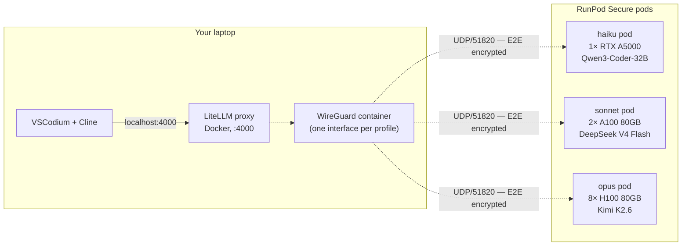

# zdr-coder

[](LICENSE)
[](#what-zdr-means-here)
[](https://www.runpod.io/press/runpod-meets-hipaa-and-gdpr-standards)

**Self-hosted Claude-Code-equivalent agentic coding inside VSCodium, with zero data retention.** One-line deploy. Cline talks to your own open-source model on rented GPUs over a private WireGuard tunnel. No third-party model provider, no Tailscale cloud, no Cloudflare, no Hugging Face token — just RunPod for the GPU.

## Three profiles, one command to switch

| Profile | Closest Claude | Open-source model | GPU shape | $/hr | $/mo @ 80 h |
|---|---|---|---|---|---|
| **haiku** | Haiku 4.5 | Qwen3-Coder-32B | 1× RTX A5000 24GB | **$0.27** | $22 |
| **sonnet** *(default)* | Sonnet 4.6 | DeepSeek V4 Flash | 2× A100 SXM 80GB | **$2.98** | $238 |
| **opus** | Opus 4.7 | Kimi K2.6 INT4 | 8× H100 SXM | **$23.92** | $1,914 |

Run any one, or all three in parallel against the same LiteLLM endpoint and switch between them in Cline by changing the Model ID.

## Architecture



- **WireGuard** = direct peer-to-peer E2E-encrypted UDP. One interface per profile (each on its own /24 subnet). No control plane, no Tailscale cloud, no Headscale, no Cloudflare. Just public-key exchange between two endpoints.
- **LiteLLM** = local OpenAI-compatible proxy. Routes per-profile aliases, holds master API key.
- **vLLM** = OpenAI-compatible model server. Downloads weights from HF-Mirror (no token) by default.
- **Cline** = the agentic coding extension in VSCodium. Talks to LiteLLM on localhost.

## What ZDR means here

There is no managed model provider in the path. The WireGuard tunnel is E2E encrypted between exactly two endpoints (your laptop and your GPU pod). LiteLLM is configured with `turn_off_message_logging: true` and `disable_spend_logs: true`. Nothing about your prompts touches a third party.

For HIPAA: RunPod offers BAA-eligible Secure Cloud — email `support@runpod.io` to execute (1–2 business day turnaround, no Enterprise contract required).

## Setup

Three steps.

### 1. Get a RunPod API key

https://console.runpod.io/user/settings → **API Keys** → **Create API Key**.

Permissions: **Read/Write on `api.runpod.io/graphql`**. No access needed to `api.runpod.ai` (that's their own hosted-inference API, not used here).

Add credits to your RunPod account.

### 2. Install prerequisites — one command

```bash
# macOS or Ubuntu/Debian
./scripts/install-prereqs.sh
```

```powershell
# Windows (PowerShell as Administrator)
.\scripts\install-prereqs.ps1
```

This installs Docker, wireguard-tools, jq, openssl, flock, VSCodium, and the Cline extension. macOS uses Homebrew, Ubuntu/Debian uses apt, Windows uses Chocolatey. Skips anything already installed.

> **Windows note:** the deploy/destroy/smoketest scripts are bash. Run them via WSL2 (recommended — Docker Desktop on Windows uses WSL2 anyway) or Git Bash.

### 3. Configure & deploy

```bash
cp .env.example .env
$EDITOR .env             # set RUNPOD_API_KEY (only required value)

./scripts/deploy.sh sonnet     # default profile (~$2.98/hr, ~Sonnet 4.6 quality)
```

Or pick a different tier:

```bash
./scripts/deploy.sh haiku      # ~$0.27/hr, ~Haiku 4.5 quality
./scripts/deploy.sh opus       # ~$23.92/hr, ~Opus 4.7 quality
```

Or run all three at once (parallel cold start, ~20 min wall time vs 60 min serial):

```bash
./scripts/deploy.sh all
# — or in three terminals for cleaner logs —
./scripts/deploy.sh haiku
./scripts/deploy.sh sonnet
./scripts/deploy.sh opus
```

Each deploy provisions its own RunPod pod, generates its own WireGuard keypair, allocates its own /24 subnet, and exposes a separate model alias in LiteLLM. They share one local LiteLLM endpoint on `http://localhost:4000` — you switch between profiles in Cline by changing the **Model ID** field (`haiku`/`sonnet`/`opus`).

When you're done coding:

```bash
./scripts/destroy.sh           # tears down all profiles
./scripts/destroy.sh sonnet    # or just one profile
```

Pod termination stops RunPod billing within ~1 minute.

### 4. Point Cline at it

The deploy script prints these — paste into VSCodium → Cline → gear:

- **API Provider**: OpenAI Compatible
- **Base URL**: `http://localhost:4000/v1`
- **API Key**: contents of `.litellm-key` (auto-generated on first deploy)
- **Model ID**: `sonnet` (or `haiku` / `opus`)

To swap between models mid-session: change the **Model ID** field. No restart, no redeploy.

## How `zdr-coder` compares to similar projects

| Project | Closeness | Differs |
|---|---|---|
| [Leafcloud `tf-leafcloud-opencode`](https://docs.leaf.cloud/en/latest/private-llm/team-opencode-vllm/) | ~70% | OpenCode TUI (not Cline), CIDR allowlist (not WG), Leafcloud-only, no BAA |
| OpenClaw + vLLM on Vast.ai / Salad | ~65% | OpenClaw runtime, no LiteLLM Anthropic shim, no mesh networking |
| [Netclode](https://github.com/angristan/netclode) | ~55% | Mobile/iOS client, Ollama not vLLM, k3s + microVM-per-session |
| ZeroClaw + LiteLLM + vLLM in Docker | ~50% | DGX Spark focus, no WG, ZeroClaw not Cline |
| BentoVLLM / OpenLLM | ~50% | Just the "model → OpenAI endpoint" piece |

**The differentiation**: nobody else ships specifically *VSCodium + Cline + LiteLLM + pure WireGuard (no control plane) + rented-GPU template + HIPAA-eligible host*. Position is compliance-grade Claude Code in 30 minutes on rented GPUs with peer-to-peer mesh.

## Caveats

- **RunPod BAA is a separate process.** Email `support@runpod.io` if you need it — 1–2 business days, no Enterprise commitment.
- **Cold start is slow.** ~10–20 min for haiku/sonnet; ~20–30 min for opus (Kimi K2.6 weights are large). Run profiles in parallel to overlap warmups.
- **No persistent vLLM cache by default.** Weights re-download on every fresh pod. RunPod supports persistent volumes if you want to keep them.
- **HF-Mirror is community-run.** Reliable for most public models. If a model isn't mirrored, set `HF_TOKEN` in `.env` to fall back to the original HF (some models still need license acceptance there).
- **Parallel mode billing.** All three profiles running = ~$27/hr. Stop tiers you aren't testing with `./scripts/destroy.sh <profile>`.

## Files

```
.
├── README.md
├── LICENSE                       # MIT
├── docker-compose.yml            # WireGuard peer (multi-interface) + LiteLLM
├── litellm/config.yaml           # model routes (haiku/sonnet/opus + heavy/plan)
├── gpu-node/
│   ├── Dockerfile                # vLLM + wireguard-tools image
│   └── start.sh                  # container entrypoint
├── scripts/
│   ├── install-prereqs.sh        # macOS/Linux installer (Homebrew/apt)
│   ├── install-prereqs.ps1       # Windows installer (Chocolatey, PowerShell)
│   ├── deploy.sh                 # one-line deploy (per profile or all)
│   ├── destroy.sh                # one-line teardown (per profile or all)
│   ├── preflight.sh              # validates prereqs + .env
│   └── smoketest.sh              # end-to-end path test (per profile)
├── wg/                           # generated WG configs (gitignored)
├── .github/workflows/            # auto-builds GPU image to GHCR
├── .env.example                  # 1 required value
└── .gitignore
```

## Troubleshooting

**`smoketest.sh` returns FAIL** — read its output; it names the broken hop.

**WireGuard handshake doesn't happen** — `docker compose exec wg-laptop wg show <profile>` should show the peer with `latest handshake` once it's working. If empty, the GPU pod's UDP port may not be exposed. Check the RunPod console for port mappings on the pod.

**vLLM "out of memory"** — shrink `MAX_LEN` or lower `--gpu-memory-utilization` to `0.88` in `gpu-node/start.sh`.

**Model download fails from HF-Mirror** — set `HF_TOKEN=hf_...` in `.env` to fall back to the original HuggingFace.

**`wg` not found** — `./scripts/install-prereqs.sh` should have installed it. If you skipped that, run it.

**Wrong RunPod permissions** — the API key needs **Read/Write on `api.runpod.io/graphql`**. The `api.runpod.ai` permission is for their hosted inference, not used here.

## Reporting vulnerabilities

Open a private security advisory on this repository's GitHub Security tab. No bounty program; we aim to respond within 5 business days.

## License

MIT — see [LICENSE](LICENSE).
