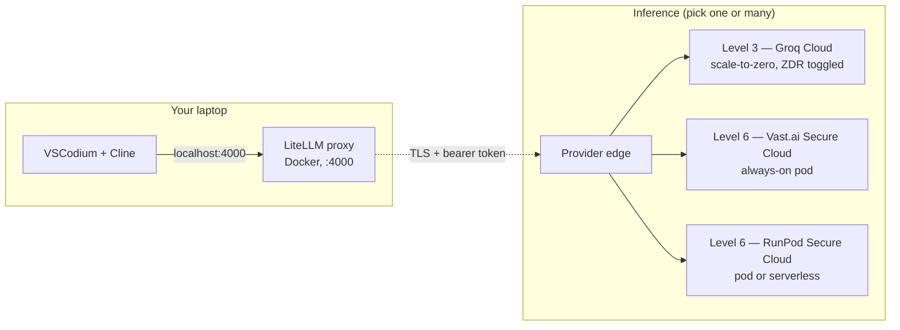

# zdr-coder

[](LICENSE)
[](COMPLIANCE.md)
[](COMPLIANCE.md)

**Self-host your AI coding assistant.** Use VSCodium + Cline like you'd use Claude Code, but your prompts never go to OpenAI, Anthropic, or Google. Two options out of the box: cheap+fast **API mode** (Groq, with zero-data-retention) or **bring-your-own-GPU mode** (rent a pod in a HIPAA-eligible datacenter, run open-source models yourself). One command sets it up. One command tears it down.

## Why this exists

**Who it's for:** engineers who want AI coding assistance without handing their prompts to OpenAI / Anthropic / Google — including teams under HIPAA, SOC 2, or IP-sensitive workloads where "the model provider promises to be nice" isn't sufficient.

**What it gives you:** one local proxy on `http://localhost:4000`, two privacy-preserving inference paths behind it, and a [tier ladder](#pick-your-privacy-level) below mapping how this stacks up against every other AI option. Drop-in for VSCodium + Cline; switch between paths by changing the Cline **Model ID**.

**Why now:** ChatGPT Plus, Claude Pro, and Gemini Advanced all train on your input by default (or by tiny opt-in toggle), and none of the three are HIPAA-BAA-eligible. Your $20/mo buys faster models, not contractual privacy. This repo gives you **contractual ZDR** (Groq Cloud, with a self-serve toggle) or **physical ZDR** (your own pod on a Tier 3-4 datacenter) for less than $1/hr active and $0 idle. Total time to first request: 5 minutes for API mode, 15 minutes for a fresh pod.

**Honest about what it doesn't do:** no cryptographic E2E (provider still sees plaintext during inference — that's a Level 5 problem requiring TEE attestation), no FedRAMP / HITRUST of the rental platform itself (their datacenter partners have it transitively). [COMPLIANCE.md](COMPLIANCE.md) documents every gap with verbatim citations.

## Pick your privacy level

There are six levels of "how private is my AI." This repo gives you ⭐ levels 3 and 6 — the rest are listed so you can see where you'd otherwise land. Every claim below is sourced from the provider's own legal docs (links + verbatim quotes in [COMPLIANCE.md](COMPLIANCE.md)).

| Level | What it is | Cost | Provider sees your prompts? | Trained on by default? | HIPAA BAA? | Compliance certs | Good for |
|---|---|---|---|---|---|---|---|
| **1. Lowest** | Free consumer chat — chatgpt.com, claude.ai free, gemini.google.com | $0 | Yes, plaintext, sampled humans may read | ChatGPT & Gemini: **yes**. Claude: opt-in only. | ❌ never | ❌ free tier excluded | Throwaway questions |
| **2. Moderate** | $20/mo consumer subs — ChatGPT Plus, Claude Pro, Gemini Advanced | ~$20/mo | Yes, plaintext, sampled humans may read | ChatGPT Plus & Gemini Advanced: **yes**. Claude Pro: opt-in (toggle in settings). | ❌ Plus / Pro / Advanced **explicitly ineligible** | ❌ consumer tier excluded | Personal coding, nothing sensitive |
| **3. High** ⭐ *this repo: `*-api` routes* | Developer APIs with ZDR option — **Groq**, OpenAI API, Anthropic API, DeepInfra | $0.13–$4.50/hr active, **$0 idle** | Yes, plaintext, no human review under contract | ❌ contractually no | ✅ on request | SOC 2 Type 2, ISO 27001 (Groq) | Most use. Sensible default. |
| **4. Very high** | Enterprise cloud LLM APIs — AWS Bedrock, Azure OpenAI Foundry, GCP Vertex | $3–$15 / million tokens | Yes, plaintext, cloud-vendor enforced no-access | ❌ contractually no | ✅ standard, no contract minimum | SOC 2, ISO 27001, **FedRAMP**, **HITRUST** | Regulated industries with audit obligations |
| **5. Maximum** | TEE-attested confidential inference — Tinfoil, GCP H100 CC mode | $5–$50/hr active or per-token | ❌ **cryptographically blind** — hardware-attested | ❌ enforced by hardware | ✅ via Tinfoil | Tinfoil: SOC 2 only. GCP: full stack | National security, ultra-paranoid PHI |
| **6. Own everything** ⭐ *this repo: `*-vast`, `*-serverless` routes* | Self-host open-weights on rented GPU — **Vast Secure Cloud**, **RunPod Secure Cloud** | $0.40–$15/hr (pod) or $0 idle (serverless) | Only the datacenter host operator's root user; contractually prohibited from introspecting (RunPod explicit, Vast implicit) | ❌ you control the model weights | ✅ via datacenter operator BAA | SOC 2 Type 2 (Vast, RunPod); ISO 27001 via DC partners | Long sessions, full audit trail, no managed-model provider in the path |

A few non-obvious things from the research:

- **Paid consumer ≠ private.** ChatGPT Plus and Gemini Advanced **default to using your chats for training**. Claude Pro defaults to opt-in (same as free Claude). None of Plus / Pro / Advanced is HIPAA-BAA-eligible. The $20 buys you faster models and higher rate limits, not contractual privacy.
- **Free Claude is more private than free ChatGPT.** Claude requires opt-in for training; ChatGPT and Gemini opt you in by default. None are BAA-eligible.
- **AWS Nitro Enclaves can't run sonnet-class models.** Nitro Enclaves have no GPU. The "confidential AI on AWS" marketing requires GovCloud Provisioned Throughput, not Enclaves.
- **Vast/RunPod compliance** is split: the rental platform holds SOC 2 Type 2, but ISO 27001 belongs to their datacenter partners, not the platform itself.
- **Groq's ZDR is the strongest "Level 3" story** because the toggle is self-serve in every account — most competitors gate ZDR behind enterprise contracts.

For each cell with verbatim provider quotes + URLs: see [COMPLIANCE.md](COMPLIANCE.md).

## What you get from this repo

| If you want… | Run this | Cost shape |
|---|---|---|
| Level 3 (API + ZDR), fastest setup | `./scripts/api-up.sh` | $0.13–$0.56/hr active, $0 idle |
| Level 6 always-on pod, cheapest | `./scripts/deploy-vast.sh haiku` (or sonnet / opus) | $0.40–$15/hr while up |
| Level 6 scale-to-zero, private | `./scripts/deploy-serverless.sh haiku` (or sonnet) | $0 idle, ~$0.50–$6/hr active |
| Stop everything | `./scripts/destroy.sh all` | $0 |

All three use the **same local endpoint** (`http://localhost:4000`). Switch between them in Cline by changing the **Model ID** field — no restart.

## Five-minute setup

```bash
# 1. Install prereqs once (Docker, jq, openssl, VSCodium, Cline extension)
./scripts/install-prereqs.sh                     # macOS / Ubuntu / Debian
# or .\scripts\install-prereqs.ps1               # Windows (PowerShell as admin)

# 2. Set up your API keys
cp .env.example .env
$EDITOR .env                                     # set GROQ_API_KEY and/or VAST_API_KEY

# 3. Pick a path and run it
./scripts/api-up.sh                              # Level 3 — easiest, ZDR via Groq
# OR
./scripts/deploy-vast.sh haiku                   # Level 6 — your own GPU pod
```

The deploy script prints the Cline configuration when it's done. Paste it into VSCodium → Cline → gear icon:

- **API Provider**: OpenAI Compatible
- **Base URL**: `http://localhost:4000/v1`
- **API Key**: contents of `.litellm-key` (auto-generated)
- **Model ID**: `sonnet-api` (or `sonnet-vast` / `haiku` / etc — see below)

Done. Start coding.

## Available model IDs

| Model ID | What runs | Where | Tier (model size) |
|---|---|---|---|
| `haiku-api` | Llama 3.1 8B Instant | Groq Cloud | Level 3, small |
| `sonnet-api` | Llama 3.3 70B Versatile | Groq Cloud | Level 3, medium |
| `haiku-vast` | Qwen2.5-Coder-32B-AWQ | Vast Secure Cloud pod | Level 6, small |
| `sonnet-vast` | DeepSeek V4 Flash (FP8) | Vast Secure Cloud pod | Level 6, medium |
| `opus-vast` | Kimi K2.6 (1T params) | Vast Secure Cloud pod | Level 6, frontier |
| `haiku-serverless` | Qwen2.5-Coder-32B-AWQ | RunPod Serverless | Level 6, small, scale-to-zero |
| `sonnet-serverless` | DeepSeek V4 Flash (FP8) | RunPod Serverless | Level 6, medium, scale-to-zero |
| `haiku` / `sonnet` / `opus` | Same as `-vast` | RunPod always-on pod | Level 6, original path |

Switching is instant — just change the field in Cline and send.

## Compliance posture

This repo's **Level 3** + **Level 6** paths together cover:

- ✅ Zero data retention (Groq self-serve toggle; Vast/RunPod by container ownership)
- ✅ No training on your data (contractual on Groq; physical on self-hosted)
- ✅ HIPAA BAA available (all three providers — see [COMPLIANCE.md](COMPLIANCE.md) for request process)
- ✅ SOC 2 Type 2 (Groq Inc, Vast Inc, RunPod Inc as of Oct 2025)
- ✅ Encryption in transit (TLS to provider edge)
- ✅ US data residency (default on all three)
- ✅ No third-party model provider in the inference path (Level 6)

What this repo does **not** give you out of the box:

- ❌ Cryptographic end-to-end (provider still sees plaintext during inference — Level 5 only)
- ❌ FedRAMP / HITRUST (Level 4 cloud APIs; or self-certify on Level 6 self-hosted)
- ❌ EU data residency (US-default; pick `*-vast` with `geolocation=EU` to override)
- ❌ Side-channel resistance on multi-tenant GPUs

[COMPLIANCE.md](COMPLIANCE.md) has the full mapping with verbatim quotes from each provider's binding legal docs, plus the 7-step checklist for maintaining max-ZDR posture on Groq.

---

## Architecture



- **LiteLLM** is the local OpenAI-compatible proxy. Routes per-model-ID aliases, holds the master API key, injects per-route bearer tokens. Bound to `127.0.0.1` only — never exposed.
- **Groq** path is direct API. ZDR toggle in console gates retention.
- **Vast / RunPod** paths spin up a pod running [`gpu-node/Dockerfile`](gpu-node/Dockerfile) (vLLM + your chosen model). LiteLLM connects via TLS-terminated proxy URL + bearer token.
- **Cline** = the agentic coding extension in VSCodium. Talks to LiteLLM on localhost.

No mesh VPN — provider-managed transport (TLS) + bearer tokens is the same E2E envelope, simpler to operate.

## Pod vs serverless vs API — when each wins

|  | API (Level 3, Groq) | Pod (Level 6, always-on) | Serverless (Level 6, scale-to-zero) |
|---|---|---|---|
| Idle cost | $0 | $0.40–$15/hr | $0 |
| Active cost | per-token (~$0.13–$0.56/hr equivalent) | included in hourly | per-second of worker uptime |
| First request | 100ms | instant (host warm) | ~3–5 min cold-start (sometimes longer for sonnet) |
| Capacity risk | Groq has plenty | thin on 80GB+ for sonnet/opus | thin on H200 for sonnet |
| Privacy | contractual ZDR | physical (your container) | physical (your container) |
| Best for | most use — bursty or continuous | 4+ hrs/day on one tier | bursty but private |

Rule of thumb: **<2 hrs/day → Level 3 API.** **>4 hrs/day → Level 6 pod.** **In between → Level 6 serverless.**

## Cost comparison — live snapshot, May 2026

Always-on pod pricing for each tier (from current available on-demand offers):

| Tier | RunPod Secure $/hr | Vast Secure Cloud $/hr | Notes |
|---|---|---|---|
| haiku (1× RTX 4090 24GB) | $0.69 | **$0.40–0.67** | Vast cheapest when Iceland host rentable |
| sonnet (4× A100 / 4× H100 80GB) | $5.96 (often sold out) | **$4.27** (A100) or **$5.87** (H100 SXM) | Vast supply thin, 1–2 hosts at a time |
| opus (8× H100 SXM 80GB) | $23.92 (often sold out) | **$11.74** | France datacenter when listed |
| opus *(alt)* 4× H200 140GB | — | **$7.74** | 560 GiB > Kimi K2.6's 554 GiB weights |

Versus going Anthropic-direct (no self-hosting): ~$30/hr for Opus-class agentic-coding workload. Crossover for opus is **~1.5 hrs/day** before self-hosted wins on cost.

## Setup detail

### Pick your provider(s)

You only need to set up the providers you'll actually use.

**Vast.ai** — cheapest Level 6 path
1. Sign up at https://cloud.vast.ai/
2. Account → Create API Key → Advanced tab
3. Permissions: **Instances** = Read+Write, everything else minimal, **2FA off** (programmatic key)
4. Copy → `.env` as `VAST_API_KEY=...`

**RunPod** — only provider with serverless wired today
1. https://console.runpod.io/user/settings → API Keys → Create
2. Permissions: **All** scope (Restricted returns 403 on serverless `/openai/v1`)
3. Add credit, copy → `.env` as `RUNPOD_API_KEY=...`

**Groq Cloud** — Level 3
1. Sign up at https://console.groq.com/
2. **Enable ZDR before first request**: https://console.groq.com/settings/data-controls
3. Create API key → `.env` as `GROQ_API_KEY=...`
4. (HIPAA) email security@groq.com requesting a counter-signed BAA — see [COMPLIANCE.md](COMPLIANCE.md)

### Deploy and tear down

```bash
# Level 3 — API mode
./scripts/api-up.sh                              # bring up LiteLLM with -api routes
./scripts/destroy.sh api                         # stop LiteLLM, keep keys

# Level 6 — Vast pods (recommended)
./scripts/deploy-vast.sh haiku                   # 1× RTX 4090, ~$0.40–0.67/hr
./scripts/deploy-vast.sh sonnet                  # 4× H100 80GB, ~$5.87/hr
./scripts/deploy-vast.sh opus                    # 8× H100 80GB, ~$11.74/hr

# Level 6 — RunPod alternatives
./scripts/deploy.sh haiku                        # always-on pod
./scripts/deploy-serverless.sh haiku             # scale-to-zero
./scripts/deploy-serverless.sh sonnet            # scale-to-zero (H200, capacity-dependent)

# Teardown
./scripts/destroy.sh haiku-vast                  # one tier
./scripts/destroy.sh all                         # everything across all providers
```

Pod termination stops billing within ~1 min. Serverless idle is already $0 (`workersMin=0`); teardown removes the endpoint + template.

### Running multiple tiers in parallel

Parallel cold-start, ~15-20 min wall time vs serial:

```bash
./scripts/deploy-vast.sh haiku &  ./scripts/deploy.sh sonnet &  wait
```

Each deploy is independent — separate bearer token, separate model alias in LiteLLM. All share `http://localhost:4000`. Switch in Cline by changing the **Model ID**.

### Using Cline from a remote SSH host (VSCodium Remote-SSH, Tailscale SSH, etc.)

If your VSCodium runs on a Mac but you're connected via Remote-SSH to a Linux box, Cline runs in the remote extension host — so its `localhost:4000` means the remote machine, not your Mac. LiteLLM stays on the Mac (keeps your provider API keys local); we tunnel port 4000 back over the SSH session you're already opening:

```bash
./scripts/tunnel.sh init <ssh-host>     # adds RemoteForward 4000 to ~/.ssh/config
./scripts/tunnel.sh deinit <ssh-host>   # removes it
./scripts/tunnel.sh status              # shows configured hosts
```

After `init`, reconnect any open Remote-SSH window (close → reopen). Cline's Base URL stays `http://localhost:4000/v1` — it's now forwarded back to your Mac. No tailnet ACL changes, no extra listeners exposed on your Mac, encrypted by the same SSH transport you're already using.

If your tailnet ACL *does* allow remote → Mac (uncommon for tagged-devices → user setups), there's also an opt-in `docker-compose.tailscale.yml` that adds a Tailscale-interface binding — see comments in that file.

### Persistent model cache (opus economics)

Avoid re-downloading the 554 GiB Kimi K2.6 weights every day:

```bash
./scripts/vol-up.sh opus            # one-time ~$6 + ~1-2 hr download
./scripts/deploy-vast.sh opus       # subsequent: 3-5 min cold start
./scripts/destroy.sh opus-vast      # stops compute, keeps volume
./scripts/vol-down.sh opus          # delete volume (end of project)
```

Monthly cost: ~$986 for 80 hrs/mo of opus use (4 hrs/day × 20 days) — about **60% cheaper than Anthropic Opus API** at typical agentic-coding token mix.

**Caveat**: Vast volumes are pinned to a specific host. If that machine disappears, the volume is unavailable until it comes back. RunPod network volumes (host-independent) aren't wired in this repo yet.

## Things we learned the hard way

Field-tested gotchas baked into the scripts as comments and filters:

- **Vast `verified` ≠ datacenter.** `verified: {eq: true}` means "host passes basic reliability checks" (marketplace tier, Docker-only isolation). The actual ZDR/HIPAA filter is `datacenter: {eq: true}` (ISO 27001, Tier 3/4, BAA-eligible). `deploy-vast.sh` hardcodes the latter.
- **Vast rents whole hosts.** Search must use `num_gpus: {eq: N}` not `gte: N` — otherwise picking an 8-GPU host for a 4-GPU TP config double-bills.
- **CUDA forward-compat doesn't work on consumer Ada.** RTX 4090 hosts with driver < 580 (`cuda_max_good < 13.0`) fail with `cudaInit error 804`. Filter forces `≥ 13.0`.
- **`runpod/worker-v1-vllm` has no `:stable` or `:latest` tag** — only versioned tags. `:stable` silently stalls forever. `deploy-serverless.sh` pins to a known-good version.
- **RunPod `Restricted` API-key scope returns 403** on `/v2/<id>/openai/v1`. Use **All** scope for serverless inference.
- **Plain HTTP on Vast.** Vast direct-port-forwarding is `http://<host>:<port>`, not HTTPS. The bearer token is the only thing keeping the endpoint private. Adequate for personal use given the bearer; run a Caddy/Cloudflared sidecar for full TLS.
- **Some multi-GPU Vast hosts have broken CDI runtime.** A subset fail container creation with "unresolvable CDI devices." Tear down and pick a different operator — per-host bug, not provider-wide.
- **Vast Serverless isn't wired here.** Their model is Python SDK + `@app.remote()` handlers, not a flag on top of pods. Tracked as a follow-up PR.
- **RunPod serverless workers go "unhealthy" on FP8 cold start with sonnet.** Diagnosed but not yet root-caused — likely worker-v1-vllm + DeepSeek V4 incompat. Use the Vast pod path for sonnet today.

## How `zdr-coder` compares to similar projects

| Project | Closeness | Differs |
|---|---|---|
| [Leafcloud `tf-leafcloud-opencode`](https://docs.leaf.cloud/en/latest/private-llm/team-opencode-vllm/) | ~70% | OpenCode TUI (not Cline), CIDR allowlist, Leafcloud-only, no BAA |
| OpenClaw + vLLM on Vast.ai / Salad | ~65% | OpenClaw runtime, no LiteLLM Anthropic shim |
| [Netclode](https://github.com/angristan/netclode) | ~55% | Mobile/iOS client, Ollama not vLLM, k3s + microVM-per-session |
| ZeroClaw + LiteLLM + vLLM in Docker | ~50% | DGX Spark focus, ZeroClaw not Cline |
| BentoVLLM / OpenLLM | ~50% | Just the "model → OpenAI endpoint" piece |

**Differentiator**: nobody else ships VSCodium + Cline + LiteLLM + rented-GPU vLLM + serverless mode + HIPAA-eligible host + verified Groq API ZDR posture as a single one-line-deploy template.

## Caveats

- **BAA is a separate process on every provider** — RunPod, Vast, Groq all gate it behind sales/email. None are self-serve clickwrap with a counter-signed PDF on file. Plan ~1-5 business days.
- **Cold start is slow.** Pods: ~10-20 min for haiku/sonnet, ~20-30 min for opus. Serverless: 3-10 min on first request after scale-to-zero. Run profiles in parallel to overlap warmups.
- **80GB datacenter supply is thin.** Sonnet (4× A100/H100 80GB) and opus (8× H100 80GB) Secure-Cloud inventory rotates hourly. Have `GPU_NAME="H200"` as a fallback.
- **No persistent vLLM cache by default** (except via `vol-up.sh`). Weights re-download each fresh pod.
- **Hugging Face anonymous works for most models.** Qwen2.5-Coder-32B-AWQ and DeepSeek V4 Flash are open-weight; Kimi K2.6 too. Gated models need `HF_TOKEN` in `.env`.
- **Parallel mode billing.** All three tiers running = ~$18-30/hr. Stop tiers you aren't testing with `./scripts/destroy.sh <profile>`.

## Files

```
.
├── README.md                       # this file
├── COMPLIANCE.md                   # full Level-by-Level compliance mapping
├── LICENSE                         # MIT
├── docker-compose.yml              # LiteLLM container
├── litellm/config.yaml             # model-ID routes
├── gpu-node/
│   ├── Dockerfile                  # vLLM image
│   └── start.sh                    # container entrypoint
├── scripts/
│   ├── install-prereqs.sh          # macOS/Linux installer
│   ├── install-prereqs.ps1         # Windows installer
│   ├── api-up.sh                   # Level 3 — Groq API mode
│   ├── deploy.sh                   # Level 6 — RunPod always-on pod
│   ├── deploy-vast.sh              # Level 6 — Vast.ai pod (recommended)
│   ├── deploy-serverless.sh        # Level 6 — RunPod serverless
│   ├── vol-up.sh / vol-down.sh     # Vast persistent volume management
│   ├── destroy.sh                  # teardown (any profile, any provider)
│   ├── preflight.sh                # validate prereqs + .env
│   └── smoketest.sh                # end-to-end path test
├── .env.example                    # API key template
└── .gitignore
```

## Troubleshooting

**`smoketest.sh` returns FAIL** — read its output; it names the broken hop.

**`403 Forbidden` from RunPod serverless** — your `RUNPOD_API_KEY` is Restricted scope. Recreate with **All** scope.

**Serverless worker stuck "initializing" or "unhealthy"** — check the RunPod dashboard for that worker's logs. Common causes: template image tag doesn't exist, GPU pool capacity, or vLLM init failure for FP8 models on non-Hopper hardware.

**vLLM "out of memory"** — shrink `MAX_LEN` or lower `GPU_UTIL`. Haiku at 8K already exhausts KV cache on 24GB after CUDA-graph capture; default is 4K.

**Cold-start request hits Cloudflare 524** — the sync `/openai/v1` path has a 120s edge timeout. Worker is fine; subsequent requests succeed once warmed.

**Vast vLLM crashes with `cudaInit error 804`** — driver too old for our container's CUDA libs. Filter forces `cuda_max_good ≥ 13.0`.

**Vast "Pulling fs layer" stalls** — host can't reach GHCR (typical of CN-located hosts). Filter `inet_down ≥ 500` Mbps.

**Vast picks an 8-GPU host when you want 4** — Vast rents whole hosts. Script uses `num_gpus: {eq: N}` to avoid this.

## Reporting vulnerabilities

Open a private security advisory on this repository's GitHub Security tab. No bounty program; aim to respond within 5 business days.

## License

MIT — see [LICENSE](LICENSE).
