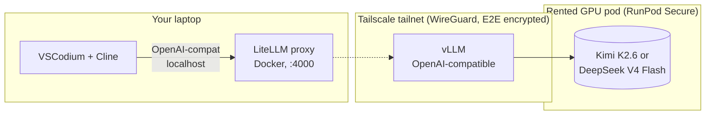

# zdr-coder

[](LICENSE)
[](#what-zdr-means-here)
[](https://www.runpod.io/press/runpod-meets-hipaa-and-gdpr-standards)

**Self-hosted Claude-Code-equivalent agentic coding inside VSCodium, with zero data retention.** Cline talks to your own Kimi K2.6 or DeepSeek V4 Flash deployment over a Tailscale mesh. No third-party model provider sees your prompts. One-line deploy, one-line teardown. HIPAA-eligible via the underlying RunPod Secure BAA.

| Profile | Model | GPUs | $/hr | Quality |
|---|---|---|---|---|
| **default** | DeepSeek V4 Flash (284B / 13B active) | 2× H200 | ~$8.62 | ~Sonnet 4.6 / just under Opus 4.6 |
| **upgrade** | Kimi K2.6 INT4 (1.1T / 32B active) | 8× H100 SXM | ~$23.92 | Beats Opus 4.6 on SWE-bench Pro |

## Architecture



- **Tailscale** = WireGuard mesh. No public ports on the GPU host. Only your tailnet can reach it.
- **LiteLLM** = local OpenAI-compatible proxy. Routes per-mode aliases, holds master API key.
- **vLLM** = OpenAI-compatible model server. Native FP4+FP8 for DeepSeek; block-FP8 or INT4 quant for Kimi.
- **Cline** = the agentic coding extension. Talks to LiteLLM on localhost.

## What ZDR means here

Self-hosting collapses the data-retention surface to **just the GPU host**. There is no managed model provider in the path. The Tailscale tunnel is end-to-end encrypted. LiteLLM is configured with `turn_off_message_logging: true` and `disable_spend_logs: true`. Nothing about your prompts touches a third party.

For HIPAA: RunPod offers BAA-eligible Secure Cloud. Email `support@runpod.io` to execute (1–2 business day turnaround). Salad SCE Secure is a cheaper alternative — **but it is SOC 2 Type I only with no HIPAA badge**, so it's suitable only for non-PHI workloads.

## Choose your GPU host

| Host | 2×H200 $/hr | 8×H100 SXM $/hr | Privacy / legal posture |
|---|---|---|---|
| **RunPod Secure** (default) | ~$7.98–$8.62 | $23.92 | SOC 2 Type I, public HIPAA + GDPR claim (Feb 2026), BAA via support |
| Salad SCE Secure (Batch) | n/a (H100 NVL only) | **$7.92** (preemptible) | SOC 2 Type I; 2022 privacy policy, $10 liability cap, no HIPAA — **non-PHI only** |
| Lambda 1-Click | ~$8.58 | $23.92 | Enterprise BAA only |
| Vast.ai interruptible | varies | ~$8–12 | No central program — marketplace |

`scripts/deploy.sh` targets RunPod Secure. To use a different host, provision manually (see [§Manual provisioning](#manual-provisioning-without-deploysh)).

## Setup

Just three things to do before deploying:

### 1. Collect five keys

- **Tailscale auth key** — https://login.tailscale.com/admin/settings/keys → Generate, toggle **Reusable** + **Ephemeral**
- **Hugging Face token** — https://huggingface.co/settings/tokens (read scope), then accept the V4 Flash license: https://huggingface.co/deepseek-ai/DeepSeek-V4-Flash
- **RunPod API key** — https://www.runpod.io/console/user/settings
- **LiteLLM master key** — `openssl rand -hex 32`
- **Your container registry path** (Docker Hub / GHCR, both free)

### 2. Build & push the GPU image

You have two options:

**Option A — Use the pre-built image** (recommended if available on your fork's GHCR):

```bash
# In .env, set:
#   GPU_IMAGE=ghcr.io/OWNER/zdr-coder-gpu:latest
# where OWNER is the GitHub user/org hosting the repo. No build step needed.
```

**Option B — Build & push it yourself** (works with any registry — Docker Hub, GHCR, ECR):

```bash
cd gpu-node
docker build -t ghcr.io/YOUR_USER/zdr-coder-gpu:latest .
docker push ghcr.io/YOUR_USER/zdr-coder-gpu:latest
```

GHCR is recommended for public projects (free, integrated with the repo, signs in via `gh auth token`). For Docker Hub, swap `ghcr.io/YOUR_USER` for `docker.io/YOUR_USER`.

### 3. Fill `.env` and deploy

```bash
cp .env.example .env
$EDITOR .env            # paste the five values from step 1
./scripts/deploy.sh     # ← one command does everything
```

`deploy.sh` runs preflight, provisions a RunPod Secure pod via GraphQL, waits for it to enter RUNNING and join your tailnet, brings up local LiteLLM via docker compose, polls for vLLM warmup (~10–20 min), runs the end-to-end smoketest, and prints your Cline configuration.

When you're done coding:

```bash
./scripts/destroy.sh    # terminates pod (billing stops in ~1 min) + stops local LiteLLM
```

### 4. Configure Cline (one-time)

Paste the values `deploy.sh` printed into VSCodium → Cline → gear:

- **API Provider**: OpenAI Compatible
- **Base URL**: `http://localhost:4000/v1`
- **API Key**: your `LITELLM_MASTER_KEY` from `.env`
- **Model ID**: `heavy`

### Switching profiles (V4 Flash ↔ K2.6)

Uncomment the upgrade-profile block in `.env`, then:

```bash
./scripts/destroy.sh && ./scripts/deploy.sh
```

### Manual provisioning (without deploy.sh)

If you'd rather click through your GPU host's UI: set env vars `TS_AUTHKEY`, `TS_HOSTNAME=zdr-coder-gpu`, `HF_TOKEN`, `MODEL`, `TP_SIZE`, `MAX_LEN` on the container. Container Disk: 400 GB for V4 Flash, 700 GB for K2.6. No public ports needed — Tailscale handles ingress. Then on your laptop: `./scripts/preflight.sh && docker compose up -d && ./scripts/smoketest.sh`.

## Costs

Active GPU-hour rates only — your laptop and LiteLLM are free. Token costs are zero (you own the model).

### V4 Flash on 2-GPU (default)

| Host (2× GPU) | $/hr | $/mo @ 80 hrs |
|---|---|---|
| RunPod Secure 2× H200 | ~$8.62 (Instant Cluster) | ~$690 |
| RunPod Secure 2× RTX 6000 Pro 96GB | ~$3.78 | ~$302 |
| RunPod Secure 2× H100 PCIe 80GB | ~$4.78 | ~$382 |
| RunPod Secure 2× A100 SXM 80GB | ~$2.98 | ~$238 |

### K2.6 on 8-GPU (upgrade)

| Host | $/hr | $/mo @ 80 hrs |
|---|---|---|
| Salad SCE Batch 8× H100 NVL (non-PHI) | $7.92 (preemptible) | $634 |
| RunPod Secure 8× A100 SXM | ~$11.92 | ~$954 |
| RunPod Secure 8× H100 SXM | ~$23.92 | ~$1,914 |

### Break-even vs managed APIs

For typical solo dev use (~10M output tokens/month):

- **DeepInfra Kimi K2.6 API**: ~$60/mo
- **Anthropic Opus 4.6**: ~$400/mo
- **Self-host V4 Flash on RunPod 2×H200**: ~$690/mo @ 80hrs

Self-host wins on **compliance posture and unlimited tokens**, not raw cost. The math flips toward self-host when you're at >$300/mo API spend, sharing the GPU across 3+ engineers, or you specifically need no third-party model provider in the path.

## How `zdr-coder` compares to similar projects

| Project | Closeness | Differs |
|---|---|---|
| [**Leafcloud `tf-leafcloud-opencode`**](https://docs.leaf.cloud/en/latest/private-llm/team-opencode-vllm/) | ~70% | OpenCode TUI (not Cline), CIDR allowlist (not Tailscale), no LiteLLM, Leafcloud-only, no BAA |
| **OpenClaw + vLLM on Vast.ai / Salad** | ~65% | OpenClaw runtime, no LiteLLM Anthropic shim, no Tailscale, no BAA-host pairing |
| [**Netclode**](https://github.com/angristan/netclode) | ~55% | Mobile/iOS client, Ollama not vLLM, k3s + microVM-per-session |
| ZeroClaw + LiteLLM + vLLM in Docker | ~50% | DGX Spark focus, no Tailscale, ZeroClaw not Cline |
| BentoVLLM / OpenLLM | ~50% | Just the "model → OpenAI endpoint" piece, no client/network/host glue |

**The differentiation**: nobody else ships specifically *VSCodium + Cline + LiteLLM (as Anthropic→OpenAI shim) + Tailscale (as auth) + vLLM + rented-GPU template + HIPAA-eligible host*. The closest is Leafcloud's tf-opencode (different client, different network), and OpenClaw with vLLM on Vast (different client, no Tailscale).

Position: **compliance-grade Claude Code in 30 minutes on rented GPUs with mesh-VPN auth**, not "yet another self-hosted Claude Code."

## Caveats

- **RunPod BAA is a separate process.** Email `support@runpod.io` if you need it — 1–2 business days, no Enterprise commitment required.
- **Cold start is slow.** ~10–20 min for V4 Flash; ~20–30 min for K2.6 INT4. Keep the node up during a work session, stop overnight.
- **Tailscale auth keys can be rotated.** Compromised? Regenerate, redeploy both containers.
- **No persistent vLLM cache by default.** Weights re-download on every fresh container. RunPod and Vast support persistent volumes; Salad ephemeral does not.
- **Salad SCE Secure is non-PHI only.** SOC 2 Type I, 2022-dated privacy policy, $10 liability cap. Fine for batch compute on non-sensitive data; not for healthcare.
- **Vendor model gating.** DeepSeek V4 and Kimi K2.6 require accepting a license on Hugging Face before download. Do this once per HF account.

## Files

```
.
├── README.md                   # this file
├── LICENSE                     # MIT
├── docker-compose.yml          # LiteLLM + Tailscale sidecar (laptop)
├── litellm/config.yaml         # model routes
├── gpu-node/
│   ├── Dockerfile              # vLLM + Tailscale image
│   └── start.sh                # container entrypoint
├── scripts/
│   ├── deploy.sh               # one-line deploy: RunPod pod + LiteLLM + smoketest
│   ├── destroy.sh              # one-line teardown
│   ├── preflight.sh            # validates prereqs + .env
│   └── smoketest.sh            # end-to-end path test
├── .env.example                # secrets template (5 required vars)
└── .gitignore
```

## Troubleshooting

**Cline says "API key invalid"** — master key mismatch. Verify `.env` matches what Cline has configured.

**Cline says "Connection refused"** — LiteLLM not running. `docker compose logs litellm`.

**`smoketest.sh` returns FAIL** — read its output; it names the specific broken hop and the next command to run.

**vLLM "out of memory"** —
- V4 Flash on 2× H100 80GB: shrink `MAX_LEN` to `131072` or lower `--gpu-memory-utilization` to `0.88`.
- K2.6 on 8× H100: 640 GB total is tight for native FP8 — make sure you're loading an INT4 quant.

**"Permission denied" pulling weights from HF** — visit the model card while signed in to HF and accept the license; verify `HF_TOKEN` is correct.

## Reporting vulnerabilities

Open a private security advisory on this repository's GitHub Security tab. No bounty program; we aim to respond within 5 business days.

## License

MIT — see [LICENSE](LICENSE).
