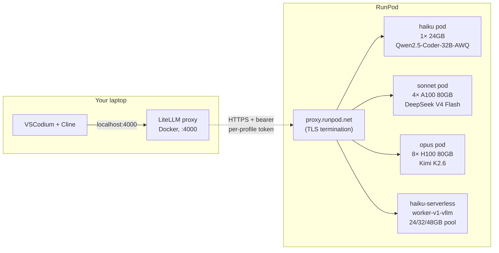

# zdr-coder

[](LICENSE)
[](#what-zdr-means-here)
[](https://www.runpod.io/press/runpod-meets-hipaa-and-gdpr-standards)

**Self-hosted Claude-Code-equivalent agentic coding inside VSCodium, with zero data retention.** One-line deploy. Cline talks to an open-source model on rented GPUs via RunPod's HTTPS proxy with per-pod bearer auth. No third-party model provider — just RunPod for the GPU.

## Three profiles, two compute modes

Pick a profile (haiku / sonnet / opus). Pick a compute mode (always-on **pod** for predictable latency, or **serverless** for pay-per-second with scale-to-zero).

| Profile | Closest Claude | Open-source model | Weights | GPU shape | Pod $/hr | Pod $/mo @ 80h |
|---|---|---|---|---|---|---|
| **haiku** | Haiku 4.5 | Qwen2.5-Coder-32B-AWQ | 18 GiB INT4 | 1× 24 GB (A5000/L4/4090) | ~$0.27–0.41 | ~$22–33 |
| **sonnet** *(default)* | Sonnet 4.6 | DeepSeek V4 Flash | 149 GiB FP8 | 4× A100-SXM4 80GB | ~$5.96 | $477 |
| **opus** | Opus 4.7 | Kimi K2.6 | 554 GiB mixed | 8× H100-SXM 80GB | ~$23.92 | $1,914 |

GPU shapes are sized to fit each model's weights plus headroom for a useful KV-cache context window. Tune via env: `GPU_TYPE_ID`, `GPU_COUNT`, `TP_SIZE`, `MAX_LEN`.

Run any one, or all three in parallel against the same LiteLLM endpoint and switch between them in Cline by changing the Model ID. Serverless is available for `haiku` today (`haiku-serverless`); sonnet/opus serverless support is on the roadmap.

## Architecture



- **LiteLLM** = local OpenAI-compatible proxy. Routes per-profile aliases, holds master API key.
- **RunPod HTTPS proxy** = `https://<pod-id>-8000.proxy.runpod.net`, TLS-terminated by RunPod, authed via a per-profile bearer token that LiteLLM injects.
- **vLLM** (pods) / **runpod/worker-v1-vllm** (serverless) = OpenAI-compatible model server. Both serve `/v1/chat/completions`.
- **Cline** = the agentic coding extension in VSCodium. Talks to LiteLLM on localhost.

There is no mesh VPN. The earlier WireGuard-based design was dropped in favor of RunPod's managed HTTPS proxy + bearer tokens — same E2E security envelope (TLS to RunPod, bearer to vLLM), simpler to operate.

## What ZDR means here

There is no managed model provider in the path. The transport from your laptop to the GPU pod is TLS to RunPod's edge, then over RunPod's internal network to the pod. LiteLLM is configured with `turn_off_message_logging: true` and `disable_spend_logs: true`. Prompts never touch a third party.

For HIPAA: RunPod offers BAA-eligible Secure Cloud — email `support@runpod.io` to execute (1–2 business day turnaround, no Enterprise contract required).

## Setup

Three steps.

### 1. Get a RunPod API key

https://console.runpod.io/user/settings → **API Keys** → **Create API Key**.

Permissions: pick **All** (full read/write to `api.runpod.io/graphql` *and* `api.runpod.ai`). The "Restricted" scope works for the pod path but returns 403 against the serverless `/openai/v1` inference endpoint — pick **All** if you want both paths to work.

Add credits to your RunPod account.

### 2. Install prerequisites — one command

```bash
# macOS or Ubuntu/Debian
./scripts/install-prereqs.sh
```

```powershell
# Windows (PowerShell as Administrator)
.\scripts\install-prereqs.ps1
```

Installs Docker, jq, openssl, flock, VSCodium, and the Cline extension. macOS uses Homebrew, Ubuntu/Debian uses apt, Windows uses Chocolatey. Skips anything already installed.

> **Windows note:** the deploy/destroy/smoketest scripts are bash. Run them via WSL2 (recommended — Docker Desktop on Windows uses WSL2 anyway) or Git Bash.

### 3. Configure & deploy

```bash
cp .env.example .env
$EDITOR .env             # set RUNPOD_API_KEY (only required value)

./scripts/deploy.sh sonnet     # default profile, ~Sonnet 4.6 quality
```

Or pick a different tier:

```bash
./scripts/deploy.sh haiku                # always-on pod, ~Haiku 4.5 quality
./scripts/deploy-serverless.sh haiku     # scale-to-zero serverless variant
./scripts/deploy.sh opus                 # always-on pod, ~Opus 4.7 quality
```

Run multiple in parallel (parallel cold start, ~20 min wall time vs serial):

```bash
./scripts/deploy.sh all
# — or in three terminals for cleaner logs —
./scripts/deploy.sh haiku
./scripts/deploy.sh sonnet
./scripts/deploy.sh opus
```

Each deploy provisions its own pod or serverless endpoint, generates its own bearer token, and exposes a separate model alias in LiteLLM. They share one local LiteLLM endpoint on `http://localhost:4000` — switch between profiles in Cline by changing the **Model ID** field (`haiku` / `haiku-serverless` / `sonnet` / `opus`).

When you're done coding:

```bash
./scripts/destroy.sh                     # tears down everything
./scripts/destroy.sh sonnet              # one pod
./scripts/destroy.sh haiku-serverless    # one serverless endpoint
```

Pod termination stops RunPod billing within ~1 minute. Serverless `workersMin=0` means idle cost is already $0; teardown deletes the endpoint + template.

### 4. Point Cline at it

The deploy script prints these — paste into VSCodium → Cline → gear:

- **API Provider**: OpenAI Compatible
- **Base URL**: `http://localhost:4000/v1`
- **API Key**: contents of `.litellm-key` (auto-generated on first deploy)
- **Model ID**: `sonnet` (or `haiku` / `haiku-serverless` / `opus`)

To swap between models mid-session: change the **Model ID** field. No restart, no redeploy.

## Pod vs Serverless — when each wins

| | **Pod** | **Serverless** |
|---|---|---|
| Idle cost | $0.27–$23.92/hr always-on | $0/hr (scales to 0) |
| Active cost | included | per-second worker billing |
| Cold start | ~15 min once (model cache survives container restarts on the same pod) | ~3–5 min on first request after idle (vLLM lazy-inits) |
| Capacity risk | Subject to GPU supply per pool/region | Multi-region worker pool, more elastic |
| Best for | Continuous use, low latency requirements | Bursty/intermittent use, idle hours don't matter |

If you code 6+ hrs/day on the same tier: pods. If you code 1–2 hrs/day or intermittently: serverless.

## Alternative provider: Vast.ai

RunPod's secure-cloud capacity for 24 GB cards (haiku) and 80 GB datacenter cards (sonnet/opus) is often constrained. [Vast.ai](https://vast.ai/) is a marketplace of independent hosts running the same datacenter + consumer GPUs at significantly lower prices, with per-second billing and no commitment. Verified offers (datacenter-grade hosts) are filterable via the API.

Live pricing snapshot (May 2026, verified on-demand offers, lowest available `$/hr`):

| Tier | Shape | RunPod $/hr | Vast.ai $/hr | Savings |
|---|---|---|---|---|
| haiku | 1× RTX 4090 24GB | $0.69 | **$0.20** | ~70% |
| sonnet | 4× A100-SXM4 80GB | $5.96 | **$2.14** | ~64% |
| opus | 8× H100 SXM 80GB | $23.92 (often sold out) | **$11.75** | ~51% |
| opus *(alt)* | 4× H200 140GB | — | **$10.33** | even better (560 GB > Kimi K2.6's 554 GB) |

Same one-line interface, separate script:

```bash
cp .env.example .env
$EDITOR .env             # set VAST_API_KEY from https://cloud.vast.ai/account/

./scripts/deploy-vast.sh haiku      # 1× RTX 4090
./scripts/deploy-vast.sh sonnet     # 4× A100-80GB on one host
./scripts/deploy-vast.sh opus       # 8× H100-80GB on one host
```

Model IDs in Cline become `haiku-vast` / `sonnet-vast` / `opus-vast`. Mix providers freely — RunPod pod for haiku, Vast for sonnet, anything you want.

Teardown:

```bash
./scripts/destroy.sh sonnet-vast    # one tier
./scripts/destroy.sh all            # everything across both providers
```

**Vast caveat — plain HTTP.** Vast's direct-port-forwarding gives you `http://<host>:<port>`, not HTTPS. The bearer token in `.vllm-key.<profile>-vast` is the only thing keeping the endpoint private. That's identical to the security envelope of the original WireGuard design and adequate for personal coding use, but if you need full TLS termination, run Caddy/Cloudflared as a sidecar inside the same container group. Filed as a future improvement.

## How `zdr-coder` compares to similar projects

| Project | Closeness | Differs |
|---|---|---|
| [Leafcloud `tf-leafcloud-opencode`](https://docs.leaf.cloud/en/latest/private-llm/team-opencode-vllm/) | ~70% | OpenCode TUI (not Cline), CIDR allowlist, Leafcloud-only, no BAA |
| OpenClaw + vLLM on Vast.ai / Salad | ~65% | OpenClaw runtime, no LiteLLM Anthropic shim |
| [Netclode](https://github.com/angristan/netclode) | ~55% | Mobile/iOS client, Ollama not vLLM, k3s + microVM-per-session |
| ZeroClaw + LiteLLM + vLLM in Docker | ~50% | DGX Spark focus, ZeroClaw not Cline |
| BentoVLLM / OpenLLM | ~50% | Just the "model → OpenAI endpoint" piece |

**The differentiation**: nobody else ships VSCodium + Cline + LiteLLM + rented-GPU vLLM + a *serverless mode option* + HIPAA-eligible host as a single one-line-deploy template.

## Caveats

- **RunPod BAA is a separate process.** Email `support@runpod.io` if you need it — 1–2 business days, no Enterprise commitment.
- **Cold start is slow.** Pods: ~10–20 min for haiku/sonnet; ~20–30 min for opus (Kimi K2.6 weights are large). Serverless: ~3–5 min on first request after scale-to-zero. Run profiles in parallel to overlap warmups.
- **24 GB GPU supply is tight.** Haiku targets a 24 GB card (A5000 / L4 / 4090) — RunPod's secure-cloud supply has been spotty during testing. `deploy.sh haiku` lets you override `GPU_TYPE_ID`; the serverless variant uses a multi-pool list (24/32/48 GB) and picks whichever has capacity.
- **No persistent vLLM cache by default.** Weights re-download on every fresh pod. RunPod supports persistent volumes if you want to keep them.
- **Hugging Face anonymous access.** Models like Qwen2.5-Coder-32B-AWQ and DeepSeek V4 Flash work without a token. Gated models need `HF_TOKEN` in `.env`.
- **Parallel mode billing.** All three pod profiles running ≈ ~$30/hr (haiku $0.41 + sonnet $5.96 + opus $23.92). Stop tiers you aren't testing with `./scripts/destroy.sh <profile>`.

## Files

```
.
├── README.md
├── LICENSE                       # MIT
├── docker-compose.yml            # LiteLLM container only
├── litellm/config.yaml           # model routes (haiku/sonnet/opus + serverless + heavy/plan)
├── gpu-node/
│   ├── Dockerfile                # vLLM image
│   └── start.sh                  # container entrypoint
├── scripts/
│   ├── install-prereqs.sh        # macOS/Linux installer (Homebrew/apt)
│   ├── install-prereqs.ps1       # Windows installer (Chocolatey, PowerShell)
│   ├── deploy.sh                 # one-line pod deploy (per profile or all)
│   ├── deploy-serverless.sh      # one-line serverless deploy (haiku today)
│   ├── destroy.sh                # one-line teardown (per profile, including serverless)
│   ├── preflight.sh              # validates prereqs + .env
│   └── smoketest.sh              # end-to-end path test (per profile)
├── .github/workflows/            # auto-builds GPU image to GHCR
├── .env.example                  # 1 required value
└── .gitignore
```

## Troubleshooting

**`smoketest.sh` returns FAIL** — read its output; it names the broken hop.

**`403 Forbidden` from `/v2/<id>/openai/v1`** — your `RUNPOD_API_KEY` is "Restricted" scope. Serverless inference needs "All" or "Read/Write". Create a new key in the RunPod console with full scope and update `.env`.

**Serverless worker stuck "initializing" with no logs** — your template image tag doesn't exist. `runpod/worker-v1-vllm` only ships versioned tags (`:v2.18.1` etc.) — there is no `:stable` or `:latest`. Update the template.

**vLLM "out of memory"** — shrink `MAX_LEN` for the profile, or lower `GPU_UTIL`. Haiku at MAX_LEN=8K already exhausts KV cache margin on 24 GB after CUDA-graph capture overhead; the default is 4K for that reason.

**Serverless worker dies with `CUDA initialization failed: out of memory` during fitness check** — host-level GPU has stale allocations from a prior worker. RunPod usually re-schedules; if it loops, exclude the specific GPU pool (e.g. drop `AMPERE_24` from `gpuIds` to skip A5000/3090 hosts) and the next worker will land elsewhere.

**Cold-start request hits Cloudflare 524** — the sync `/openai/v1` path has a ~600s edge timeout. The worker is fine; subsequent requests will succeed once it finishes warming. Or use the async `/run` + `/status` API for very long warmups.

## Reporting vulnerabilities

Open a private security advisory on this repository's GitHub Security tab. No bounty program; we aim to respond within 5 business days.

## License

MIT — see [LICENSE](LICENSE).
