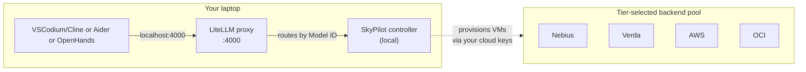

# zdr-coder

[](LICENSE)
[](COMPLIANCE.md)
[](COMPLIANCE.md)

**Self-host your AI coding assistant with verifiable ZDR.** Open-weights models (DeepSeek V4 Pro, GLM-4.5-Air, Qwen3-Coder, GPT-OSS) on rented GPU, behind one local OpenAI-compatible proxy. One config picks your compliance/cost tier; SkyPilot[^skypilot] aggregates supply across providers and fails over automatically.

> **Never used a terminal?** Jump to [📚 If you've never used a terminal](#-if-youve-never-used-a-terminal-read-this-first).

## 5-minute setup

```bash
# 1. Run the interactive setup (creates venv, installs SkyPilot, prompts you per backend)
./scripts/setup.sh

# 2. Start the local proxy + agent
./start.command  (mac) | ./start.bat  (win) | ./scripts/api-up.sh  (linux)

# 3. Use it
open http://localhost:3000                   # OpenHands (browser) — or point Cline/Aider at :4000
```

The setup script reads `ZDR_TIER` from `.env` (defaults to `soc2`) and walks you through web signups + key paste for the backends that tier needs. Each backend prompt is **Y / n** — pressing `n` skips for this run; re-run `./scripts/setup.sh` any time to add a backend later.

### Known signup issues

- **Nebius may decline US-issued cards** at signup (Stripe declines, even with travel notice + international transactions enabled — happens with both BofA and Citi). Workarounds: try a Wise or Revolut card, or just `skip` Nebius and proceed with Verda + RunPod (2-way failover is fine).
- **AWS Bedrock model access** is per-account approval. Llama/Mistral are usually instant; Anthropic Claude needs a one-time request form (~1 hr approval).
- **AWS p5/p5e/p5en GPU quota** defaults to 0 on new accounts. 1–4 day approval through the quota request form. If you need fast on-instance compliance, use Bedrock (Path 1) instead.

### Known backend capability gaps

- **Verda doesn't support `open_ports`**. That breaks `sky launch` AND `sky serve` for any config that needs an externally-reachable vLLM endpoint (which is all 6 SkyPilot configs in this repo). Verda's catalog is currently used only as a fallback for non-port-exposing workloads.
- **No `1× L40S` SKU on Verda**. Verda sells H100 / H200 / B200 (mid-to-high tier). For 1× L40S the better target is RunPod or Lambda (1× A100).
- **RunPod through SkyPilot is Secure Cloud only** — the catalog ships only `_SECURE` instance types. Community Cloud isn't reachable via SkyPilot. Good news for compliance, no config needed.
- **Vast.ai only auto-forwards port 8080** (via `ssh_host:ssh_port+1`). All sky/*.yaml configs use port 8080 — don't change it unless you also reconfigure Vast.
- **OCI does NOT support `docker_image`** in SkyPilot. The 6 sky/*.yaml configs use `image_id: docker:vllm/vllm-openai:v0.10.0`, so OCI is excluded from their backend pools (it works for `sky check`, just not these YAMLs).
- **Bucket mount for opus weights** is OPTIONAL. Only useful if you run `opus-serve` (scale-to-zero) with infrequent traffic; for `opus-pod` (always-on) the first launch is slow but subsequent restarts are fast. **Cheap neoclouds (Vast/RunPod) don't support FUSE-MOUNT for buckets** — only AWS/GCP/Azure do. Use `mode: COPY` if you must stage weights through R2 from Vast/RunPod.

### Reality check: mid-2026 GPU capacity

These came up during this repo's actual deployment testing and are worth knowing before you waste an afternoon:

| GPU | Reality | Implication |
|---|---|---|
| **8× H200 (opus tier)** | Genuinely scarce across **all** clouds. Vast bid 400s, RunPod 8× H200 has an allocator bug, AWS p5e InsufficientCapacity, GCP A3 Ultra is reservation-only | Opus tier may simply not launch on a given day; AWS Capacity Blocks (1-14 day pre-paid windows) is the most reliable path |
| **4-8× H100 (sonnet tier)** | AWS quota approved ≠ AWS has capacity. Even with 192 vCPU quota, p5.48xlarge returns `InsufficientInstanceCapacity` in us-east-1/2/west-1/2 | Fall back to **p4de.24xlarge (8× A100 80GB, $27/hr us-east-1)** — GLM-4.5-Air fits comfortably; `sonnet-pod.yaml`'s `accelerators:` list already includes `A100-80GB:8` |
| **1× L40S (haiku tier)** | AWS G-family quota (g5/g6e) default = 0 vCPUs and **per-region**. Smallest g6e.xlarge needs 4 vCPUs. | Use **Lambda 1× A100 SXM4** ($1.99/hr, plentiful supply) instead — `haiku-pod.yaml` already targets this |
| **vLLM Docker image** | `vllm/vllm-openai:latest` requires CUDA driver 12.9+ which Lambda's hosts don't have | Pin to `vllm/vllm-openai:v0.10.0` (already in the YAMLs); v0.10.0 supports driver 12.4+ |
| **AWS GPU quotas** | Per-region. The "Running On-Demand P instances" 192 vCPU quota approved in us-east-2 doesn't grant capacity in eu-west-2 / us-west-2 / etc. | Submit the same request in every region you intend to use. Single approval ≠ global. |
| **Vast.ai SSH** | ~30% of hosts refuse SSH for 10+ min after rental | `sky launch --retry-until-up` is mandatory; rolls through hosts/regions automatically |

## Pick your path

There are two orthogonal axes: **what models you want** and **what compliance you need**. Most users only need the first axis.

### Path 1: Managed APIs (recommended for non-devs and anyone not needing self-hosted opus)

No GPU provisioning. No quota requests. Sign up, paste key, done. Both options below are wired in the repo.

| Goal | Backend | Setup | Cost | Compliance |
|---|---|---|---|---|
| Cheapest, ZDR-eligible | **Groq API** (Level 3) — `haiku-api` + `sonnet-api` | https://console.groq.com → API Keys → toggle ZDR | $0 idle, ~$0.10–$0.20/hr active | SOC 2 Type II + ISO 27001 + HIPAA-BAA-eligible[^groq-baa] |
| Need a signed BAA right now, click-through | **AWS Bedrock** (Level 4) — managed Claude/Llama | https://console.aws.amazon.com/bedrock → Accept BAA in AWS Artifact → enable model access | ~$3–$15 per million tokens | Full AWS stack: SOC 2 + ISO 27001/27017/27018 + FedRAMP Moderate/High + HITRUST + signed BAA[^aws-baa] |

The non-dev path is Groq unless your compliance team specifically requires a vendor-signed BAA. Bedrock is the BAA path that doesn't require GPU quota increases (it's a managed API, not EC2). You skip the entire "GPU acquisition" problem.

### Path 2: Self-hosted on rented GPU (this is where the tier picker matters)

Pick this if you want **opus-class** (DeepSeek V4 Pro, Kimi K2.6) under ZDR, or want to run *your* container instead of someone else's API. One env var picks the SkyPilot backend pool; SkyPilot handles failover.

**This repo is sales-free by design.** No phone calls, no scheduled demos, no enterprise contracts. Every backend in the table below can be set up entirely through web signup + CLI keys. Tiers requiring sales calls for BAA (CoreWeave, OCI, Vast Secure tier) are documented in the master table but **not** wired into a default `ZDR_TIER` — if you genuinely need their BAA, you'd configure them as a one-off override.

| `ZDR_TIER` | Compliance posture | Backends configured | Cost/hr (opus tier) | Sales contact required? | When to pick |
|---|---|---|---|---|---|
| `cheap` | None — marketplace tier | Vast.ai + RunPod Community | $20.71–$35.12 | ❌ Never | Personal / non-regulated, fast iteration |
| `soc2` ⭐ default | SOC 2 Type II + ISO 27001 | **Nebius + Verda + RunPod Community** | $26–$36 | ❌ Never (web signup + CLI keys only) | Most businesses; instant on/off; per-second billing |
| `hipaa` | BAA-signed via self-serve click-through | **AWS + Azure** | $55–$110 | ❌ Never (BAA self-serve in console) | Healthcare/PHI workloads. ⚠️ Both require GPU quota request forms (no calls, but 1–4 day approval) |

The recommended default for self-hosted is `soc2`:
- Nebius explicitly includes HIPAA in their SOC 2 Type II scope[^nebius-trust] (rare for a neocloud)
- Verda gives EU-sovereign redundancy[^verda-faq] with a clean 4× H200 SKU at $16/hr
- RunPod Community covers US datacenters and smaller 1× SKUs for haiku tier
- **All three are instant-on (~30–90s GPU acquisition), instant-off (~10–30s billing stop), per-second billing, and require zero human contact**

`hipaa` carries real friction: AWS p5e/p5en require GPU quota approvals (default = 0) via a web form, and Capacity Block reservations (minimum 1-day windows, pre-paid). The BAA itself is still click-through, but you'll wait 1–4 days for GPU quota. If you need BAA without the quota dance, use **AWS Bedrock** in Path 1 — managed Claude, no GPU provisioning, no quota request, BAA included.

**Removed from default tiers** (still in the master table below for reference):
- ❌ CoreWeave — mandatory sales onboarding before trial
- ❌ OCI — sales-gated BAA via account team
- ❌ RunPod Secure Cloud — sales-gated BAA (use RunPod Community for `cheap`/`soc2` tiers instead)
- ❌ Fluidstack, Cudo — quote-only pricing
- ❌ Lambda — sales-gated for H200; trust portal silent on HIPAA
- ❌ Hyperstack — only SOC 2 Type I (not Type II), no native SkyPilot integration

## What those compliance standards actually mean (plain English)

You don't need to be a lawyer to pick a tier. Here's what each cert actually buys you, ordered roughly weakest → strongest for our purposes:

| Standard | What it is | Who audits | What it proves | When you need it |
|---|---|---|---|---|
| **ISO 27001** | International infosec management standard | Independent certification body | Vendor has a documented information security management system (ISMS) — policies, risk register, incident response | Baseline for any business buyer. Widely accepted globally. |
| **SOC 2 Type II** | US audit framework | Licensed CPA firm, over 6–12 months | Vendor's controls actually *worked* over a sustained period (not just on paper) | Stronger than ISO 27001 because it tests sustained operation. Required by most US enterprise procurement. |
| **HIPAA BAA** | US healthcare law (Business Associate Agreement) | Not an audit — it's a *signed legal contract* | Vendor accepts legal liability for protected health information (PHI). Underlying controls usually SOC 2 + ISO 27001. | If you're processing patient data, this is a hard legal requirement — not just a checkbox. |
| **FedRAMP Moderate** | US federal authorization based on NIST 800-53 | A federal agency or the FedRAMP JAB | Vendor meets ~325 specific controls reviewed by US gov | Required for federal contracts; widely respected even outside gov. |
| **FedRAMP High** | Same but ~421 controls + stricter reviews | Same | Maximum rigor for sensitive federal systems | National security, DoD-adjacent, classified-adjacent work. |

**Honest caveats** (relevant to picking your tier):

1. **HIPAA isn't strictly "stronger than SOC 2"** — it's a different category. HIPAA is a *law about PHI*; SOC 2 is *an audit of controls*. Most vendors with HIPAA BAA also have SOC 2 + ISO 27001 underneath. So in practice the tiers stack: `soc2` ⊆ `hipaa` ⊆ `fedramp`.
2. **"Compliance" ≠ "security"**. A vendor can hold every cert and still be breached. These certs prove the vendor follows defined processes; they don't prove the processes are impenetrable.
3. **You usually inherit your vendor's certs** but only for the controls they cover. If you process PHI on AWS EC2, AWS's BAA covers their part of the stack; you still need to configure encryption, access control, audit logging in your own VMs.
4. **"BAA available" varies wildly** between vendors. AWS/Azure/GCP are click-through self-serve (minutes). CoreWeave / Nebius / RunPod are sales-gated (1–5 business days). Crusoe / Verda / Fluidstack / Cudo don't offer BAA at all, regardless of how strong their other certs are.

**The honest "which tier do I need?" decision tree:**

- Just personal use, not regulated → `cheap`
- Building a business product but not touching healthcare/finance/gov data → `soc2` ⭐
- Touching ANY US healthcare data (PHI) → you legally need `hipaa` or stronger
- Federal contract requirement → `fedramp`

If you're unsure, default to `soc2`. You can move up later by adding a different `.env` config; SkyPilot lets you swap backends without changing your model setup.

## Master compliance table

Every claim cited; URLs at end of section.

Columns ordered weakest → strongest (ISO is the broadest baseline; FedRAMP High is the most rigorous).

| Backend | ISO 27001 | SOC 2 Type II | HIPAA BAA | FedRAMP | EU regions | SkyPilot | Tenancy |
|---|---|---|---|---|---|---|---|
| **Vast.ai (Secure tier)** | DC-partner level[^vast-comp] | ✅ (recent)[^vast-comp] | ⚠️ Secure Cloud only, `compliance@vast.ai`[^vast-comp] | ❌ | DC-partner[^vast-comp] | ✅ Native — `vastai set api-key`[^sky-vast] | Marketplace |
| **Cudo Compute** | DC inheritance[^cudo-home] | ⚠️ "Aligned" (not certified)[^cudo-home] | ❌ Not advertised[^cudo-home] | ❌ | ✅ UK/FI/SE/NO[^cudo-dc] | ✅ Native — `cudoctl init`[^sky-cudo] | VM |
| **Hyperstack (NexGen)** | ⚠️ In progress, early 2026[^hs-sec] | ⚠️ **Type I only**, Type II pending[^hs-sec] | ❌ Not offered[^hs-sec] | ❌ | ✅ UK/Norway/Spain[^hs-prc] | ❌ No native SkyPilot[^sky-clouds] | Single-tenant VM |
| **Paperspace (via DO)** | DC level[^do-trust] | ✅ (DO level)[^do-trust] | ⚠️ DO BAA but Paperspace NOT in HIPAA scope[^do-hipaa] | ❌ | ✅[^do-regions] | ✅ Native — `~/.paperspace/config.json`[^sky-pap] | Shared multi-tenant |
| **Crusoe** | ✅ +27001/42001[^cru-soc] | ✅ (Feb 2026 renewal)[^cru-soc] | ❌ Not advertised[^cru-trust] | ❌ | ✅ Iceland + Norway[^cru-eu] | ❌ No native, no K8s docs | Bare-metal |
| **Fluidstack** | ✅[^fs-home] | ✅[^fs-home] | ❌ Not advertised | ❌ | ✅[^fs-home] | ✅ Native — `~/.fluidstack/api_key`[^sky-fs] | Single-tenant |
| **Verda / DataCrunch** | ✅ +27017/18/701[^verda-faq] | ✅[^verda-faq] | ❌ Not advertised (sales contact only)[^verda-contact] | ❌ | ✅ Finland (EU-only)[^verda-faq] | ✅ Native — `~/.verda/config.json`[^sky-verda] | Bare-metal |
| **Lambda** | ✅ +27017/27701/22301[^lambda-trust] | ✅[^lambda-trust] | ⚠️ Sales-gated (marketing claims HIPAA, trust portal silent)[^lambda-trust] | ❌ (claimed in marketing only)[^lambda-gov] | Limited | ✅ Native — `~/.lambda_cloud/`[^sky-lambda] | Bare-metal / shared |
| **RunPod (Secure tier)** | DC-partner level[^runpod-comp] | ⚠️ Type I (Type II in progress)[^runpod-comp] | ✅ Sales-gated, Secure Cloud only[^runpod-comp][^runpod-press] | ❌ | ✅ Per-DC filter[^runpod-comp] | ✅ Native — `runpod config`[^sky-runpod] | T3/T4 DCs |
| **Nebius** | ✅ +27017/18/701[^nebius-trust] | ✅[^nebius-trust] | ✅ **HIPAA in SOC 2 scope** (sales-gated, `security@nebius.com`)[^nebius-trust] | ❌ | ✅ Finland + France[^nebius-eu] | ✅ Native — `nebius iam`[^sky-nebius] | VPC-isolated |
| **CoreWeave** | ✅ +27017/18[^cw-trust] | ✅[^cw-trust] | ⚠️ Sales-gated (trust portal NDA)[^cw-trust] | ❌ | Partial (per colo)[^cw-eu] | ❌ K8s via CKS[^cw-cks] | Single-tenant |
| **OCI** | ✅[^oci-iso] | ✅ (SOC 1/2/3)[^oci-soc] | ✅ EY-attested HIPAA program[^oci-baa] | ✅ **High via JAB**[^oci-fedramp] | ✅ 6 EU + 2 sovereign[^oci-regions] | ✅ Native — `~/.oci/config`[^sky-oci] | Bare-metal |
| **AWS** | ✅ +27017/18[^aws-iso] | ✅[^aws-soc] | ✅ **Self-serve (click-through in AWS Artifact)**[^aws-baa][^aws-hipaa] | ✅ High (GovCloud) / Moderate (commercial)[^aws-fedramp] | ✅ 8 EU regions[^aws-regions] | ✅ Native — `aws configure`[^sky-aws] | Nitro VM / BM |
| **Azure** | ✅[^az-iso] | ✅[^az-soc] | ✅ **Auto-included in DPA**[^az-baa] | ✅ **High**[^az-fedramp] | ✅ 13 EU regions[^az-regions] | ✅ Native — `az login`[^sky-az] | Shared VM |
| **GCP** | ✅[^gcp-iso] | ✅[^gcp-soc] | ✅ Console request (org admin)[^gcp-baa] | ✅ **High via Assured Workloads**[^gcp-fedramp] | ✅ 13 EU regions[^gcp-regions] | ✅ Native — `gcloud auth`[^sky-gcp] | Shared / sole-tenant |

## Master pricing table

On-demand $/hr, verified June 2026. AWS uses Capacity Block (CB) pricing for H200; on-demand p5e/p5en is even higher.

| Backend | 1× L40S | 1× H100 SXM | 4× H100 | 8× H100 | 4× H200 | 8× H200 | Pricing page |
|---|---|---|---|---|---|---|---|
| **Vast.ai** | ~$0.50 | $1.49–2.50 (marketplace) | varies | varies | varies | varies | [link][^vast-pricing] |
| **RunPod** | $0.86 | $3.29 | per-GPU × 4 | per-GPU × 8 | $17.56 (per-GPU × 4) | $35.12 (per-GPU × 8) | [link][^runpod-pricing] |
| **Hyperstack** | L40 only ($1.00) | $2.40 | $9.60 | $19.20 | $14.00 | $28.00 | [link][^hs-prc] |
| **Verda / DataCrunch** | $1.37 | $3.25 | **$13.00** | **$26.00** | **$16.00** | **$32.00** | [link][^verda-products] |
| **Nebius** | $1.82 | $3.85 | $15.40 | $30.80 | $18.00 (no 4× SKU; per-GPU × 4) | **$36.00** | [link][^nebius-prices] |
| **Lambda** | listed | $4.29 | per-GPU × 4 | $31.92 | ❌ | cluster sales only | [link][^lambda-pricing] |
| **Crusoe** | sales | $3.90 | $15.60 | $31.20 | $17.16 | $34.32 | [link][^cru-pricing] |
| **CoreWeave** | $18/node | n/a | n/a | $49.24 | n/a | $50.44 OD / **$20.93 spot** | [link][^cw-pricing] |
| **Fluidstack** | listed | quote-only | quote-only | quote-only | quote-only | quote-only[^fs-pricing] | [link][^fs-pricing] |
| **Cudo** | quote | quote | quote | quote | quote | quote | [link][^cudo-pricing] |
| **Paperspace (DO Droplets)** | $1.57/GPU | $3.39/GPU | $13.56 | $27.12 | $13.76 (per-GPU × 4) | $27.52 (per-GPU × 8) | [link][^do-pricing] |
| **OCI** | not separately sold | not separately sold | not separately sold | **$80.00** (BM.GPU.H100.8) | not separately sold | **$80.00** (BM.GPU.H200.8) | [link][^oci-pricing] |
| **AWS** | $30.13 (g6e.48xl, 8× L40S) | not sold 1× (p5 8× min) | n/a | **$55.04** (p5.48xl) | n/a (8× min) | **$39.80** CB / $63 OD (p5e.48xl)[^aws-cb] | [link][^aws-cb] |
| **Azure** | ~$2.40 | n/a (ND v5 = 8×) | n/a | **$98.32** (ND_H100_v5)[^az-h100] | n/a | **$110.24** (ND_H200_v5)[^az-h200] | [Vantage] |
| **GCP** | $1.95 (g2) | $11.06 (a3-high 1g) | n/a | **$88.49** (a3-high-8g)[^gcp-a3] | n/a | **$98.13** (a3-ultra-8g, eu-west1-b only)[^gcp-ultra] | [Vantage] |

Notes:
- **Cheapest per config across all tiers**: Vast.ai (cheap), Verda (soc2), AWS Capacity Block (hipaa/fedramp).
- **4× H200 SKU availability is the hardest** — Verda has a clean 4× SKU at $16/hr; most others sell only 1× or 8×.
- **AWS p5e/p5en on-demand pricing is not on the public EC2 pricing page** — only via Capacity Blocks reservation page[^aws-cb], which jumped 15% in Jan 2026[^aws-hike].

## ⭐ Recommended config as of June 2026

For `ZDR_TIER=soc2` (the default), configure these **2 keys** for full failover:

```bash
# .env
ZDR_TIER=soc2

# Primary: Nebius — BAA in SOC2 scope, EU+US, "no waitlist" up to 8× H200
NEBIUS_IAM_TOKEN=...          # get at https://nebius.com/console (iam → get-access-token)
NEBIUS_TENANT_ID=...

# Backup: Verda (DataCrunch) — SOC2 + ISO27001/17/18/701, EU-sovereign Finland, clean 4× SKU
VERDA_CLIENT_ID=...           # get at https://console.verda.com → Credentials
VERDA_CLIENT_SECRET=...
```

`sky check` will confirm both are healthy. `sky launch --gpus H200:8 --cloud vast` runs DeepSeek V4 Pro on Vast France for ~$22/hr. `sky serve up` with `min_replicas: 0` does the same with scale-to-zero.

If you need a **counter-signed BAA**, flip to `ZDR_TIER=hipaa` and configure AWS instead (`aws configure`, BAA self-serve in [AWS Artifact](https://aws.amazon.com/compliance/hipaa-compliance/)). If you need **FedRAMP**, add Azure + OCI alongside.

### Opus-tier hardware reality check (1T+ MoE models)

Naive math says 554 GB weights should fit on 8× H100 80GB (640 GB) or 4× H200 141GB (564 GB). **In production neither actually works.** Per a [real production deployment writeup](https://medium.com/@shivank1128/deploying-kimi-k2-5-on-h200-gpus-the-real-story-nobody-tells-you-7a18a6ca905a):

| Config | Total VRAM | Result |
|---|---|---|
| 4× H200 141GB | 564 GB | ❌ **OOM** — weights consume 549 GB, leaving 3 GB for KV cache |
| 8× H100 80GB | 640 GB | ❌ **Likely OOM** — 128K KV cache alone wants 32–64 GB; ~91 GB headroom after weights isn't enough with BF16 attention layers |
| **8× H200 141GB** | **1,128 GB** | ✅ **Works** — 549 GB weights, 579 GB for KV + activations + overhead |
| 16× H100 (2 nodes + IB) | 1,280 GB | ✅ Works but multi-node = InfiniBand orchestration |

The "554 GB" number is the *download size*. Once vLLM loads it with BF16 attention/embeddings/language head (~130–140 GB un-quantized) plus KV cache + activations + CUDA overhead, you need 1+ TB VRAM. The `sky/opus-*.yaml` configs in this repo target `H200:8` exclusively to avoid this trap.

## Available model IDs

LiteLLM proxies your client requests to the right backend. Switch by changing the **Model ID** field — no restart.

| Model ID | What runs | Replica policy | Backend (per tier) | Cost/hr |
|---|---|---|---|---|
| `haiku-api` | GPT-OSS 20B (Groq) | always-warm | Groq Cloud (Level 3) | $0.10 active, $0 idle |
| `sonnet-api` | GPT-OSS 120B (Groq) | always-warm | Groq Cloud (Level 3) | $0.20 active, $0 idle |
| `haiku-pod` | Qwen3-Coder-30B-A3B-Instruct-FP8 (~30 GB) | `min_replicas: 1` | SkyPilot, tier-selected | $1.37–1.90 |
| `sonnet-pod` | **GLM-4.5-Air** (106B/12B MoE, MIT) | `min_replicas: 1` | SkyPilot, tier-selected | $10–14 (4× H100) or ~$4 (1× H200 FP8) |
| `opus-pod` | **DeepSeek V4 Pro** (1.6T/49B MoE, MIT, needs 8× H200) | `min_replicas: 1` | SkyPilot, tier-selected | $22–32 |
| `haiku-serve` | Qwen3-Coder-30B-A3B-Instruct-FP8 | `min_replicas: 0` | SkyPilot serve, scale-to-zero | $0 idle, ~$1.50 active (cold start ~60–90s) |
| `sonnet-serve` | GLM-4.5-Air | `min_replicas: 0` | SkyPilot serve, scale-to-zero | $0 idle, ~$10 active (cold start ~90s FP8) |
| `opus-serve` | DeepSeek V4 Pro (8× H200 only) | `min_replicas: 0` ⚠️ | SkyPilot serve, scale-to-zero | $0 idle, ~$28 active (cold start ~4–6 min — see [warmup tricks][#opus-cold-start]) |

Switching is instant — change the field in Aider (`ZDR_MODEL=...`) or Cline (Model ID).

## Honest tier mapping — what actually matches each Claude tier?

| Want | Route in this repo | Real cost | Performance vs Claude |
|---|---|---|---|
| Haiku-class, cheapest | `haiku-api` (GPT-OSS 20B on Groq) | $0.10 active, $0 idle | Comparable for simple edits; coding-tuned |
| Sonnet-ish, scale-to-zero managed | `sonnet-api` (GPT-OSS 120B on Groq) | $0.20 active, $0 idle | Between Sonnet 3.5 and Sonnet 4 |
| Sonnet-class, self-hosted | `sonnet-pod` (GLM-4.5-Air, MIT, 12B-active MoE) | $4–14/hr | Solid Sonnet-class; 128K context; **good** tool calling for agentic loops |
| Opus-class | `opus-pod` (DeepSeek V4 Pro on 8× H200) | $22–32/hr | Frontier open model (Apr 2026); 1M context; **good** tool calling (vs Kimi K2.6's mediocre) |

There's no Groq-API equivalent for Opus-tier — Groq's catalog tops out at GPT-OSS 120B. Opus-class under ZDR means self-hosting.

## Client setup

LiteLLM serves OpenAI-compatible on `http://localhost:4000/v1`. Point any agentic coding tool at it.

**OpenHands** (browser, best for non-developers): `./scripts/openhands-up.sh` → http://localhost:3000

OpenHands spawns a fresh sandbox container per conversation. Settings → LLM → Advanced Settings:

| Field | Value | Why |
|---|---|---|
| Custom Model | `openai/haiku-api` (or any wired Model ID) | `openai/` prefix tells OpenHands to use OpenAI-compatible API format |
| Base URL | **`http://host.docker.internal:4000/v1`** | `localhost` from inside the sandbox refers to the sandbox itself; `host.docker.internal` is Docker's special hostname that resolves to your Mac/Linux host where LiteLLM is listening |
| API Key | contents of `.litellm-key` | Auto-generated by `api-up.sh` |

**Don't use `http://litellm:4000/v1`** even if it seems cleaner — OpenHands sandboxes are launched dynamically on the default `bridge` network and can't resolve docker-compose service names there. `host.docker.internal` is the architecturally correct choice and is what `openhands-up.sh` passes as the default env var.

**Hermes Agent** (TUI + messaging-gateway, best for sysadmin / SSH / web search / scheduled tasks):
```bash
./scripts/hermes-up.sh                              # installs Hermes + writes ~/.hermes/config.yaml
hermes                                              # launches the TUI
```

[Nous Research's Hermes Agent](https://github.com/nousresearch/hermes-agent) (MIT, 181k★ as of mid-2026) ships with 40+ built-in tools — web search, deep research, cloud browser, shell across multiple backends, cron-style scheduling, image gen, TTS, MCP server support — and a built-in self-improving learning loop. Where OpenHands shines for repo-aware coding work, Hermes shines for everything else.

`hermes-up.sh` wires it to your local LiteLLM proxy and writes a safety-first config:
- `approvals.mode: manual` — every dangerous shell command pauses for `[o]nce | [s]ession | [a]lways | [d]eny`. Covers ~50 patterns: `rm -r`, `chmod 777`, `mkfs`, `dd if=`, `sudo`, `curl | sh`, `> /etc/`, `systemctl stop`, `kill -9`, etc.
- **Hardline blocklist** (no override): `rm -rf /`, fork bombs, `mkfs` on mounted root, `dd` to `/dev/sd*`.

Switch mid-session inside the TUI with `/model haiku-pod` (or any model ID from `litellm/config.yaml`). To disable approvals for a single run (NOT for production): `hermes --yolo`.

**Aider** (terminal, recommended for developers):
```bash
./scripts/aider-up.sh   # one-time
./scripts/aider.sh      # launch (defaults to sonnet-api)
ZDR_MODEL=opus-pod ./scripts/aider.sh   # switch mid-session
```

**Cline / Roo Code** (VSCode/VSCodium extension): API Provider = `OpenAI Compatible`, Base URL = `http://localhost:4000/v1`, API Key = `cat .litellm-key`, Model ID = `sonnet-api` (or any from the table above).

## Comparison: privacy levels outside this repo

This repo gives you **Level 3** (Groq API + ZDR) and **Level 6** (self-hosted on rented GPU). For context on what you'd otherwise land on:

<details>
<summary>Show full Level 1–6 comparison table</summary>

| Level | What it is | Cost | Provider sees prompts? | Trains on by default? | HIPAA BAA? | Good for |
|---|---|---|---|---|---|---|
| **1. Lowest** | Free consumer chat (chatgpt.com, claude.ai, gemini.google.com) | $0 | Yes, plaintext, sampled humans may read | ChatGPT & Gemini: yes. Claude: opt-in. | ❌ never | Throwaway questions |
| **2. Moderate** | $20/mo consumer subs (ChatGPT Plus, Claude Pro, Gemini Advanced) | $20/mo | Yes | Plus/Advanced yes; Claude Pro opt-in | ❌ explicitly ineligible | Personal coding, nothing sensitive |
| **3. High** ⭐ *this repo `*-api`* | Developer APIs with ZDR (Groq, OpenAI API, Anthropic API) | $0.13–$4.50/hr active | Yes, no human review under contract | ❌ | ✅ on request | Most use, sensible default |
| **4. Very high** | Enterprise cloud LLM APIs (AWS Bedrock, Azure OpenAI, GCP Vertex) | $3–$15/M tokens | Yes, cloud-vendor enforced no-access | ❌ | ✅ standard | Regulated industries |
| **5. Maximum** | TEE-attested confidential inference (Tinfoil, GCP H100 CC) | $5–$50/hr | ❌ cryptographically blind | ❌ hardware-enforced | ✅ via Tinfoil | National security |
| **6. Own everything** ⭐ *this repo `*-pod`, `*-serve`* | Self-host on rented GPU, **4 sub-tiers**: `cheap` / `soc2` / `hipaa` / `fedramp` | $0.50–$110/hr | ❌ you control container | ❌ you control weights | ✅ via `hipaa` or `fedramp` tier | Long sessions, audit trail, no third-party model provider |

</details>

Verbatim citations for each cell in [COMPLIANCE.md](COMPLIANCE.md).

## Honest performance caveats — read before betting on these aliases

- **Long-horizon tool-use consistency**: Claude Opus 4.7 still leads on 20+ tool-call agentic loops. Open-weights drift more in long sessions. Mitigation: shorter scope per session, explicit `/clear` between unrelated tasks.
- **Aider edit-block format compliance**: GPT-OSS 120B, GLM-4.5-Air, and DeepSeek V4 Pro are reliable on the default `diff` format. Older Qwen2.5/Llama 3.x models dropped it ~5–10% of the time; Qwen3-Coder is meaningfully better. If a model misbehaves, try `--edit-format whole` or `udiff`.
- **GPQA / scientific reasoning**: Opus 4.7 leads (~94%). No open-weights model matches it yet.
- **MCP-Atlas / structured tool orchestration**: Opus 4.7 leads.
- **Cost vs quality crossover**: <2 hrs/day → Level 3 API is cheaper than self-hosted. >4 hrs/day → self-hosted wins.
- **Context length** in practice: K2.6 advertises 256K, but quality degrades past ~50K input on all open-weights. Keep contexts tight.

## opus cold start

DeepSeek V4 Pro weights (~800 GB FP4+FP8 on disk, ~1 TB loaded) make scale-to-zero painful (4–6 min first request on 8× H200). Two mitigations baked in:

1. **Bucket mount**: pre-stage weights once in cloud storage, mount on boot. ~2 min cold start.
2. **Custom VM image** with weights baked in: ~60–90s cold start.

If neither is acceptable, set `opus-pod` (`min_replicas: 1`) and use `sky serve down` / `sky serve up` as a manual on/off switch.

<details>
<summary>Architecture</summary>



SkyPilot's controller runs on your machine. It uses your direct cloud API keys to provision VMs in your accounts — no third-party in the data path. Your prompts go from LiteLLM (local) → provisioned VM (your tenancy) → response. SkyPilot Inc. never sees them.

</details>

<details>
<summary>📚 If you've never used a terminal, read this first</summary>

[Existing non-developer walkthrough — preserved verbatim. See git history for full text. The Groq API path (`ZDR_TIER` unused) is still the recommended starter for non-developers.]

1. Install Docker Desktop: https://docs.docker.com/desktop/
2. Get a Groq API key: https://console.groq.com/ → API Keys
3. Toggle ZDR ON: https://console.groq.com/settings/data-controls
4. Download this project, copy `.env.example` → `.env`, paste `GROQ_API_KEY=`
5. Double-click `start.command` (Mac) or `start.bat` (Windows)

Skip the `pip install skypilot` step — the Groq path uses Level 3 API mode, no GPU provisioning needed.

</details>

<details>
<summary>Caveats and things we learned the hard way</summary>

- **BAA is a separate process on every provider** — AWS, Azure, GCP are click-through self-serve. Nebius, CoreWeave, RunPod, Vast, Lambda are sales-gated (plan 1–5 business days). Crusoe, Verda, Fluidstack, Cudo: not offered.
- **Cold start is slow.** Pods: 10–20 min first launch on a new backend (weights download). Serverless: 2–5 min cold on warm-image; 10+ min from scratch.
- **80GB datacenter supply is thin** for sonnet-pod (4× A100/H100 80GB) on Vast/RunPod Secure. SkyPilot auto-fails over to the next backend in your tier.
- **Vast.ai marketplace vs Secure Cloud** — Vast Secure Cloud is BAA-eligible (T3/T4 DCs)[^vast-comp]; Community is not.
- **No persistent vLLM cache by default.** First launch on each backend pulls weights from HuggingFace.
- **Parallel mode billing** — all three tiers running = ~$18–30/hr. Use `sky down --all` to stop everything.

</details>

<details>
<summary>Troubleshooting</summary>

- **`sky check` fails on a backend** — confirm the auth command from the integration table ran cleanly; some backends (Nebius, Verda) require both an API token AND a tenant/project ID in env or config file.
- **`sky launch` says "no resources satisfy"** — your tier's backends are out of capacity for that GPU shape. Add more backends in your `.env` (re-run `./scripts/setup.sh`) — Vast almost always has H100/H200 supply when RunPod is dry.
- **Serverless 524 timeout on first request** — cold start exceeded edge timeout. The replica is still warming; retry in 60s.
- **vLLM OOM on opus** — you tried to run DeepSeek V4 Pro (or Kimi K2.6) on 4× H200 (564 GB) or 8× H100 (640 GB). **Doesn't work** for either model, despite naive weight math suggesting it might — attention layers + KV cache + CUDA overhead push real requirement past 1 TB. Use 8× H200 (1,128 GB) only. See "Opus-tier hardware reality check" above.

</details>

## Files

```
.
├── README.md                       # this file
├── COMPLIANCE.md                   # verbatim citations per cell
├── LICENSE
├── start.command / start.bat       # double-click launchers (Mac / Windows)
├── stop.command / stop.bat
├── docker-compose.yml              # LiteLLM container
├── litellm/config.yaml             # model-ID routes
├── gpu-node/                       # vLLM Dockerfile + entrypoint
├── sky/                            # SkyPilot YAML configs per tier
│   ├── haiku-pod.yaml              # min_replicas: 1
│   ├── sonnet-pod.yaml
│   ├── opus-pod.yaml
│   ├── haiku-serve.yaml            # min_replicas: 0
│   ├── sonnet-serve.yaml
│   └── opus-serve.yaml
├── scripts/
│   ├── install-prereqs.sh
│   ├── api-up.sh                   # Level 3 — Groq API
│   ├── sky-up.sh                   # Level 6 — bring up via SkyPilot per tier
│   ├── sky-down.sh
│   ├── openhands-up.sh             # browser agent UI
│   ├── hermes-up.sh                # Nous Hermes TUI agent w/ manual approval
│   ├── aider.sh
│   └── smoketest.sh
├── .env.example
└── .gitignore
```

## License

MIT — see [LICENSE](LICENSE).

---

## References

[^skypilot]: https://github.com/skypilot-org/skypilot
[^aws-baa]: https://aws.amazon.com/compliance/hipaa-compliance/
[^aws-hipaa]: https://aws.amazon.com/compliance/hipaa-eligible-services-reference/
[^aws-soc]: https://aws.amazon.com/compliance/soc-faqs/
[^aws-iso]: https://aws.amazon.com/compliance/iso-27001-faqs/
[^aws-fedramp]: https://aws.amazon.com/compliance/services-in-scope/FedRAMP/
[^aws-regions]: https://aws.amazon.com/about-aws/global-infrastructure/regions_az/
[^aws-cb]: https://aws.amazon.com/ec2/capacityblocks/pricing/
[^aws-hike]: https://www.datacenterdynamics.com/en/news/aws-quietly-increases-prices-for-h200-ec2-instances-by-15/
[^az-baa]: https://learn.microsoft.com/en-us/compliance/regulatory/offering-hipaa-hitech
[^az-soc]: https://learn.microsoft.com/en-us/azure/compliance/offerings/offering-soc-2
[^az-iso]: https://learn.microsoft.com/en-us/azure/compliance/offerings/offering-iso-27001
[^az-fedramp]: https://learn.microsoft.com/en-us/azure/compliance/offerings/offering-fedramp
[^az-regions]: https://learn.microsoft.com/en-us/azure/reliability/regions-list
[^az-h100]: https://instances.vantage.sh/azure/vm/nd96isrh100-v5
[^az-h200]: https://instances.vantage.sh/azure/vm/nd96isrh200-v5
[^gcp-baa]: https://cloud.google.com/security/compliance/hipaa
[^gcp-soc]: https://cloud.google.com/security/compliance/soc-2
[^gcp-iso]: https://cloud.google.com/security/compliance/iso-27001
[^gcp-fedramp]: https://cloud.google.com/security/compliance/fedramp
[^gcp-regions]: https://cloud.google.com/about/locations
[^gcp-a3]: https://instances.vantage.sh/gcp/a3-highgpu-8g
[^gcp-ultra]: https://instances.vantage.sh/gcp/a3-ultragpu-8g
[^oci-baa]: https://www.oracle.com/cloud/public-cloud-regions/hipaa/
[^oci-soc]: https://docs.oracle.com/en-us/iaas/Content/ComplianceDocuments/Concepts/compliancedocsoverview.htm
[^oci-iso]: https://blogs.oracle.com/cloud-infrastructure/iso-27001-certificate-and-soc-1-2-and-3-attestations-for-oracle-cloud-infrastructure
[^oci-fedramp]: https://www.fedramp.gov/marketplace/products/FR1900048743/
[^oci-regions]: https://www.oracle.com/cloud/public-cloud-regions/
[^oci-pricing]: https://www.oracle.com/cloud/compute/gpu/
[^cw-trust]: https://www.coreweave.com/security
[^cw-cks]: https://docs.coreweave.com/docs/products/cks
[^cw-eu]: https://www.coreweave.com/blog/coreweaves-european-expansion-lets-power-tomorrows-ai-innovations
[^cw-pricing]: https://www.coreweave.com/pricing
[^cru-trust]: https://trust.crusoe.ai/
[^cru-soc]: https://www.crusoe.ai/resources/blog/crusoe-cloud-achieves-soc-2-type-ii
[^cru-eu]: https://crusoe.ai/newsroom/crusoe-announces-strategic-european-expansion-with-first-data-center-in/
[^cru-pricing]: https://www.crusoe.ai/cloud/pricing
[^nebius-trust]: https://nebius.com/trust-center
[^nebius-eu]: https://nebius.com/newsroom/nebius-to-construct-310-mw-ai-factory-in-finland
[^nebius-prices]: https://nebius.com/prices
[^sky-nebius]: https://docs.skypilot.co/en/latest/cloud-setup/cloud-permissions/nebius.html
[^verda-faq]: https://verda.com/faq
[^verda-products]: https://verda.com/products
[^verda-contact]: https://verda.com/contact
[^sky-verda]: https://docs.skypilot.co/en/latest/getting-started/installation.html
[^lambda-trust]: https://lambda.ai/trust
[^lambda-gov]: https://lambda.ai/government
[^lambda-pricing]: https://lambda.ai/pricing
[^sky-lambda]: https://docs.skypilot.co/en/latest/getting-started/installation.html
[^runpod-comp]: https://www.runpod.io/legal/compliance
[^runpod-press]: https://www.runpod.io/press/runpod-meets-hipaa-and-gdpr-standards
[^runpod-pricing]: https://www.runpod.io/pricing
[^sky-runpod]: https://docs.skypilot.co/en/latest/getting-started/installation.html
[^vast-comp]: https://vast.ai/compliance
[^vast-pricing]: https://vast.ai/pricing
[^sky-vast]: https://docs.skypilot.co/en/latest/getting-started/installation.html
[^fs-home]: https://fluidstack.io
[^fs-pricing]: https://fluidstack.io/resources/pricing
[^sky-fs]: https://docs.skypilot.co/en/latest/getting-started/installation.html
[^hs-sec]: https://www.nexgencloud.com/security
[^hs-prc]: https://www.hyperstack.cloud/gpu-pricing
[^sky-clouds]: https://github.com/skypilot-org/skypilot/tree/master/sky/clouds
[^cudo-home]: https://www.cudocompute.com/
[^cudo-dc]: https://www.cudocompute.com/data-centers
[^cudo-pricing]: https://www.cudocompute.com/pricing
[^sky-cudo]: https://docs.skypilot.co/en/latest/getting-started/installation.html
[^do-hipaa]: https://www.digitalocean.com/trust/hipaa-at-do
[^do-trust]: https://www.digitalocean.com/trust/certification-reports
[^do-regions]: https://docs.digitalocean.com/platform/regional-availability/
[^do-pricing]: https://www.digitalocean.com/pricing/gpu-droplets
[^sky-pap]: https://docs.skypilot.co/en/latest/getting-started/installation.html
[^sky-aws]: https://docs.skypilot.co/en/latest/getting-started/installation.html
[^sky-az]: https://docs.skypilot.co/en/latest/getting-started/installation.html
[^sky-gcp]: https://docs.skypilot.co/en/latest/getting-started/installation.html
[^sky-oci]: https://docs.skypilot.co/en/latest/getting-started/installation.html
